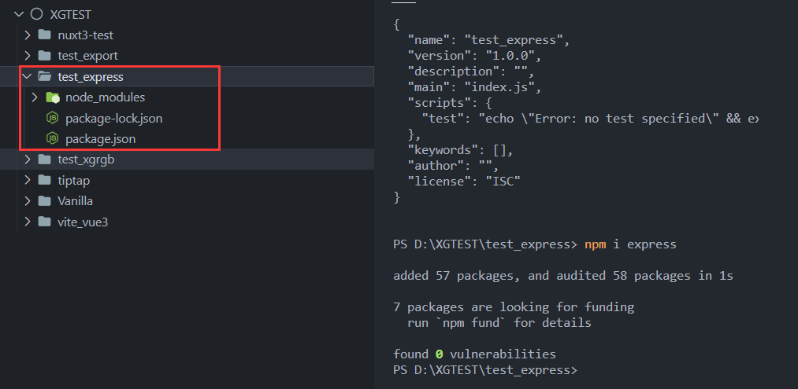
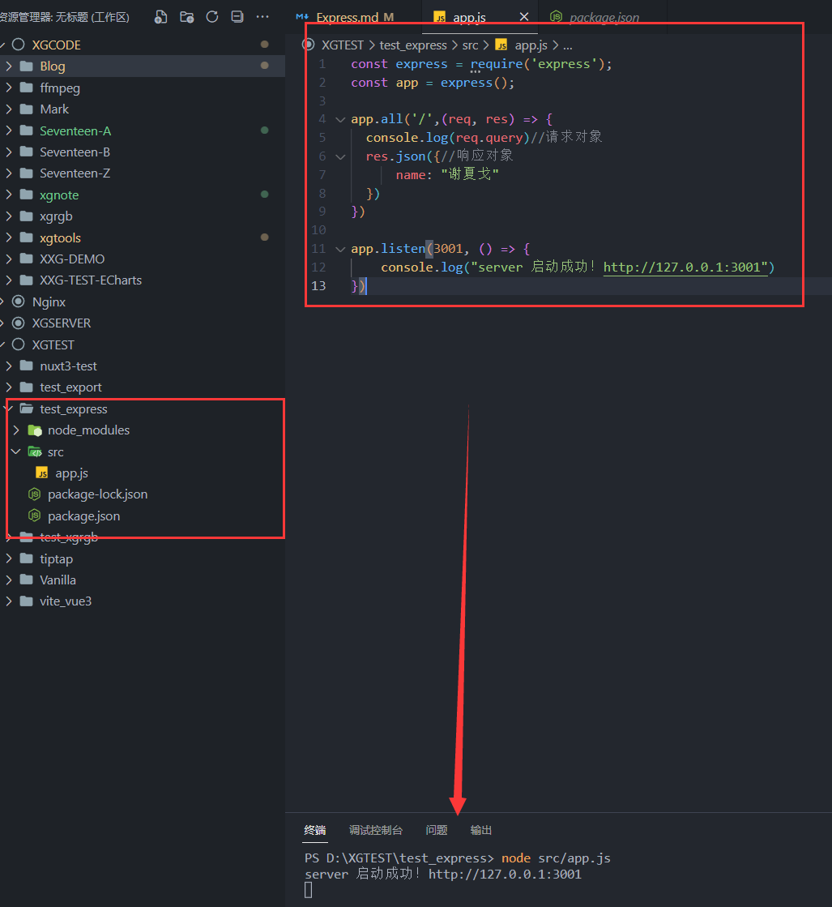
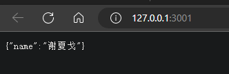

# Express

Express是Node的一个框架，能用它来方便的搭建一套api服务  

Node + Express 搭建出最简单的一个服务👇
[[toc]]
## 安装 
1. 安装前确保已经下载了 Node.js
2. 新建一个文件夹 - `test_express`
3. 在 `test_express` 文件夹的终端输入如下命令
```sh 
npm init -y
npm i express
```

  

## 创建入口文件 app.js
在根目录创建 `src/app.js` ,引入 `express` 并实例化
```js
const express = require('express');
const app = express();
```
## 开启一个最简单的服务 👇
`app.all`的`all`代表接收所有类型的请求
```javascript
// src/app.js
const express = require('express');
const app = express();

app.all('/',(req, res) => {
  console.log(req.query)//请求对象
  res.json({//响应对象
      name: "volcano"
  })
})

app.listen(3001, () => {
    console.log("server 启动成功！http://127.0.0.1:3001")
})
``` 
在终端输入`node src/app.js`  
这样就开启了一个最简单的服务拉!  

    

👇 在浏览器输入 http://127.0.0.1:3001 先访问起来~      
  

::: tip req 与 res
req和res都是继承Node原生对象   
req - http.IncomingMessage    
res - http.ServerResponse   

官方文档：[http://expressjs.com/en/4x/api.html](http://expressjs.com/en/4x/api.html)

#### req是请求对象
```javascript
req.url // 请求地址
req.method //请求方法
req.headers  //获得请求头
//....  还有很多 
req.query.q //获得参数
req.cookie //获取cookie
//官方文档：http://expressjs.com/en/4x/api.html
```
#### res是响应对象
```javascript
res.statusCode = 201 //修改成功响应码~

res.send('cxc') //发送内容

res.cookie('foo','bar') // 向客户端发送cookie
res.end() //结束响应
//官方文档：http://expressjs.com/en/4x/api.html
```
::: 


## 接口 / 接口路由

前面实例了 `express` 给到变量 `app`，那么接下来就是写接口服务的方法了👇

一般【前端】的请求有`GET` `POST`.....

`app.get` 和 `app.post` 接收`GET` `POST`的请求
```javascript
//1.引入...

//2.中间件 

//3. 接口
app.get('/', async (req,res) => {
  res.json('我是GET')
})
app.post('/', async (req,res) => {
  res.json('我是POST')
})

//4. 启动服务... 设置端口和IP地址
```
### 优化👇 try - catch
**每个接口都要使用 try - catch**
```javascript
app.get('/', async (req,res) => {
  try {
    //...
    res.json('我是GET')
  }catch(err){
    //...
  }
}
```

## 【中间件】 app.use
【中间件】就是放在【引入】和【接口】之间，用来提前处理一些事情 

::: tip 🌰
打个比方，在【前端】发来请求后，一般会有一个【请求路径】和【请求参数】！  
那么在这个【请求】在去到【服务接口】之前被这个【中间件】先拦截下来做一些处理....
::: 


**全局中间件 要放在所有路由前面**
```javascript
//1.引入...

//2.中间件 比如先引入这两个常用的中间件，后面还有~
app.use(express.json()) //配置解析表单请求  json格式的 application/json
app.use(express.urlencoded()) // 解析x-www-form-urlencoded

//3. 接口

//4. 启动服务... 设置端口和IP地址
```
::: tip 总结
1. 中间件就是用来预先处理一些进来的请求，放在所有路由前面~
2. 相当于一个【拦截器】
3. 需要使用【next()】 来让请求向下放行
4. 所有中间件放上上游，路由放下游，错误处理放最后！
:::
```javascript
app.use((req,res,next) => {
  console.log(req)
  next()
})        

//get 也有next 可以理解get 其实也是中间件。
//或者说，use是获取所有类型请求 和【app.all】有点类似！
app.get((req,res,next) => {
  console.log(req)
  next()
})
```


### 【中间件】捕获错误 
在所有的路由挂载之后挂载【错误处理中间件】

1. 必须四个参数，缺一不可
```javascript
app.use((err,req,res,next)=>{
  console.log('错误',err)
  res.status(500).json({
    error:err.message
  })
})
```

2. 所有路由的catch要next(err)
```javascript
router.get('/',async(req,res,next) => {
  try{
    //...
  }catch(err){
    next(err)
  }
})
```
### 【中间件】处理404
在所有的路由之后，在错误处理之前

1. 它类似于最后兜底的处理
1. 它和错误处理不一样， 【错误处理】需要 next(err) 触发。 
1. 404这个中间件是 找不到路由而触发的。
```javascript
//1.引入

//2.中间件预处理

//3.api接口 或者 路由中间件

//4.404处理
app.use((req,res,next)=>{
    res.status(404).send("404 Not Found")
})

//5.错误处理

//6.开启服务
```
### 内置中间件（5个）
前三个最常用！
1. `express.json()` 【解析】【Content-Type : application/json】
2. `express.urlencoded()` 【解析】【Content-Type : application/x-www-from-urlencoded】
3. `express.static` 【托管静态资源文件】
4. `express.raw()` 【解析】【Content-Type : application/octet-stream】
5. `express.text()` 【解析】【Content-Type : text/plain】


## 本章基础代码👇
```js
// 1.引入
const express = require("express");
const app = express();

// 2.中间件
app.use(express.json())
app.use(express.urlencoded()) 

// 3. 接口
app.get("/", (req, res, next) => {
  try {
    console.log(req.query); //请求对象
    res.json({
      //响应对象
      name: "volcano",
    });
  } catch (err) {
    next(err);
  }
});

// 4.404
app.use((req, res, next) => {
  res.status(404).send("404 Not Found");
});

// 5.错误处理
app.use((err, req, res, next) => {
  console.log("错误", err);
  res.status(500).json({
    error: err.message,
  });
});

// 6.开启服务
app.listen(3001, () => {
  console.log("server 启动成功！http://127.0.0.1:3001");
});
```
## 下一章：Nodemon - 热加载