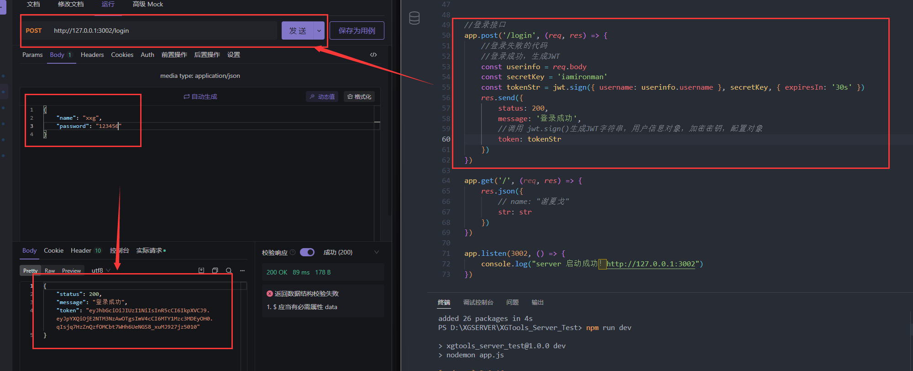
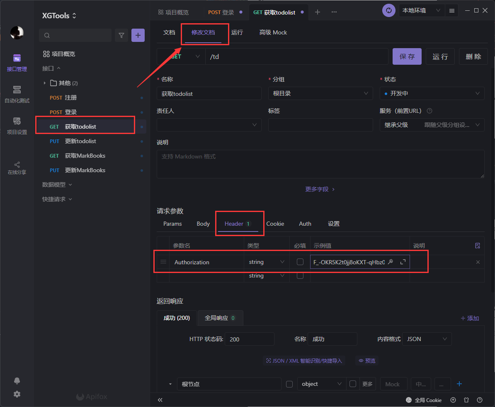
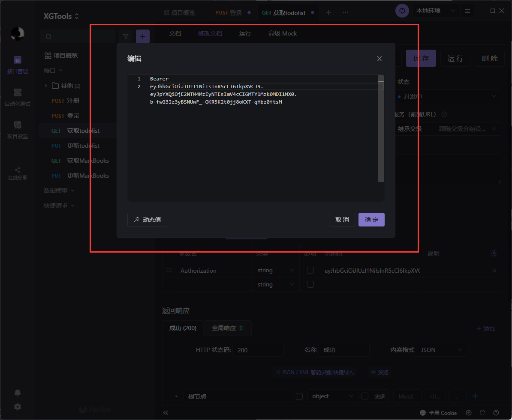

# JWT认证机制

### JWT 
JSON Web Token 是目前**最流行**的**跨域认证解决方案**
### JWT工作原理：

1. 客户端登录：提交账号和密码
1. 验证后，只通过【账号名】-【加密】生成Token字符串
1. Token发送到客户端 保存到【LocalStorage】
1. 客户端再次发送请求时，通过请求头Authoerization字段将Token发送给服务器
1. 服务器确认Token再发送内容！
### JWT的组成部分：

1. Header - 头部（安全性的相关部分）
1. Payload - 有效荷载(才是用户的真正信息）
1. Signature - 签名（安全性的相关部分）

三者之间使用 "." 风格
```javascript
Headder.Payload.Signature
```
#### JWT使用方法：

1. 客户端收到服务器返回的Token后保存在LocalStorage
1. 请求时在Authorization字段中
```javascript
Authorization: Bearer <token>
```
## Express中使用JWT 
### 安装JWT包

1. `jsonwebtoken` 用于生成JWT字符串
1. `express-jwt` 用于将JWT字符串解析还原成JSON对象
```sh
npm install jsonwebtoken express-jwt
```
### 导入
```javascript
const jwt = require('jsonwebtoken');
const expressJWT = require('express-jwt');
//express-jwt 6版本以上用👇引入
const { expressjwt: expressJWT } = require('express-jwt');
```
### 定义secret密钥【俗称：加盐】
为了保证JWT字符串的安全性，防止JWT字符串在网络传输过程中被别人破解，我们需要专门定义一个用于加密和解密的secret密钥：

1. 生成JWT字符串时，需要用secret对用户信息【加密】最终得到加密好的JWT。
1. 吧JWT字符串解析还原成JSON对象的时候，需要使用secret进行加密
```javascript
//随便写一个字符串。
const secretKey = 'iamironman'
```
::: tip 
其实还可以用一些插件随机生成这个【盐】然后把这个盐同样保存到数据库里~  
每一个用户单独拥有一个【盐】
:::

## 🃏【jsonwebtoken】生成JWT字符串
1. 调用jsonwebtoken的sign()方法👇
2. 把生成出来的Token返回给【前端】
3. Bearer是前缀~，是Token的一部分
4. 三个参数分别为：【用户名】【盐】【保存时长expiresIn】
5. 保存时长可以设置久一点，30s太短，过期Token就会失效~
6. 【注意】参数里千万不要有密码！！！
```javascript
const secretKey = 'iamironman'

//登录接口
app.post('api/login', (req, res) => {
    //登录失败的代码
    //登录成功，生成JWT
    const userinfo = req.body
    res.send({
        status: 200,
        message: '登录成功',
        //调用 jwt.sign()生成JWT字符串，用户信息对象，加密密钥，配置对象
        token: 'Bearer '+jwt.sign({ username: userinfo.username }, secretKey, { expiresIn: '30s' })
    })
})
```
👇可以利用【postman】或【Apifox】来测试接口！

  


## 🃏【express-jwt】解析Token
> npm地址：[https://www.npmjs.com/package/express-jwt](https://www.npmjs.com/package/express-jwt)

将JWT字符串还原为JSON对象

#### 🃏1、 express-jwt
```javascript
const secretKey = 'iamironman'

//expressJWT({ secret:secretKey}) 用来解析Token的中间值
//.unless({path:[/^\/api\//]})) 用来指定哪些接口不需要访问权限~

app.use(expressJWT({ secret:secretKey }).unless({path:[/^\/api\//]}))
```
- `expressJWT({ secret:secretKey })` 是固定格式解析也要用上【盐】
- `unless`是忽略掉不需要Token验证的路由
#### 🃏2、express-jwt 6版本以上👇
```javascript
// 导入👇
const { expressjwt: expressJWT } = require('express-jwt');

app.use(expressJWT({ secret: secretKey,algorithms:['HS256'] }).unless({ path: [/^\/api\//] }))
```
- `expressJWT({ secret: secretKey,algorithms:['HS256'] })`是固定写法


- 注意： 只要配置成功了 `express-jwt` 就可以把解析出来的用户信息，挂载到`req.user` 属性上（6版本以上是挂载到`req.auth.username`）  
- 记住：千万不要把密码 加密到Token中

### 🌰 举个例子
```javascript
app.get('/td', expressJWT({ secret: secretKey, algorithms: ['HS256'] }), (req, res) => {
    console.log(req.auth.username)
    res.json({
        data: req.auth
    })
})
```
也可以在api接口用调用，然后他会把解析出来的附加在req的auth上

1. req.user
2. req.auth 【express-jwt 6版本以上】

### Apifox【测试】
1. 在请求参数中设置【参数名】：Authorization
2. 然后设置【示例值】  

  

### 请求头前面要加Bearer
  

### 🃏捕获解析JWT失败后产生的错误👇

1. 过期
1. 不合法
```javascript
app.use((err, req, res, next) => {
    //token解析失败导致的错误
    if (err.name === 'UnauthorizedError') {
        return res.send({ status: 401, message: '无效的token' })
    }

    //其他原因导致的错误
    res.send({ status: 500, message: '未知错误' })
})
```
::: danger 
这时候，你肯定很疑惑！  

怎么就发放Token了呢~ 都还没验证密码是否正确...   

没错！其实是需要验证密码是否正确以后再把用户名的Token给发放出去的  
正确的整个过程是这样的👇  
1. 【用户注册】：前端验证账号和密码是否合规
2. 后端接收到后也验证一次，然后把【用户名】存入数据库
3. 【密码】通过【🔒bcryptjs加密】后也存入数据库
4. 把【随机盐】也存入数据库，当然，比较懒也可以用【固定盐】
5. 然后这相当于【注册成功】。
6. 在【注册成功】和【登录成功】后都需要给用户生成一个【Token】
7. 【登录】的话，用户提供用户名和密码
8. 先去数据库查看是否有这个【用户名】，如果没有就告知【密码错误】或【此用户名不存在】
9. 如果有此用户就把它的【加密过的密码】拿出来。
10. 利用`bcrypt.compareSync(用户登录时传来的密码,数据库里加密的密码)`里的方法进行比对。如果密码比对正确，就会返回`True`
11. 这时候就算登录成功，可以给用户返回一个`Token`以及相关的用户信息。
12. 这个【Token】是会保存在用户的浏览器客户端的，如果【过期】了就会失效。所以要设置好过期的【重新登录】
:::