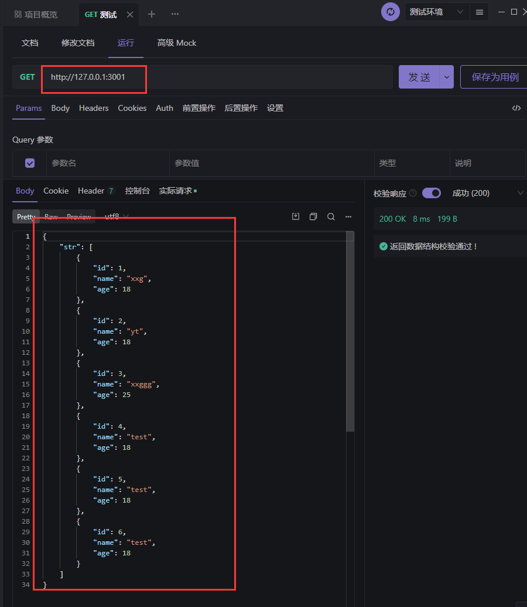

# Express + 🐬 MySQL

1. 在连接【本地数据库】时，先确保【本地数据库】服务开启了~
2. 并且有对应的数据库与数据表
### 🐬 安装 mysql2 
```sh
npm install mysql2
```
### 🐬 引入mysql2 与 连接

```js
//1.其他引入
const mysql = require('mysql2')

const db = mysql.createdb({
    host: 'localhost',
    port: '3306',
    user: 'root',
    password: '123456',
    database: 'test_db'
})
db.connect();
```
  

```js
// 1.引入
const express = require("express");
const app = express();
// 2.中间件
app.use(express.json())
app.use(express.urlencoded()) 


//👇👇👇👇👇【测试数据库】👇👇👇👇👇👇
const mysql = require('mysql2')

const db = mysql.createdb({
    host: 'localhost',  //主机：本地
    port: '3306',   //端口：默认都是3306
    user: 'root',  //用户名
    password: '123456',  //密码
    database: 'test_db'  //数据库名
})
db.connect(); //连接！

//【写SQL指令】
let sql = 'SELECT * FROM biao';
let str = '';
db.query(sql, function(err, result) {
    if (err) {
        console.log('[SELECT ERROR]：', err.message);
    }
    str = result;
    console.log(result);
});
db.end();//数据库访问完要记得关闭

// 3. 接口
app.get("/", (req, res, next) => {
  try {
    res.json({
      str
    });
  } catch (err) {
    next(err);
  }
});
//👆👆👆👆👆👆👆👆👆👆👆👆👆👆👆👆👆👆


// 4.404
app.use((req, res, next) => {
  res.status(404).send("404 Not Found");
});
// 5.错误处理
app.use((err, req, res, next) => {
  console.log("错误", err);
  res.status(500).json({
    error: err.message,
  });
});
// 6.开启服务
app.listen(3001, () => {
  console.log("server 启动成功！http://127.0.0.1:3001");
});
```

### ⭕ 用Apifox测试 👇
  


## 🐬 插入数据
```js
const user = { username:'cxcg', password:'12345678' }

const sql = 'INSERT INTO users (username,password) VALUES (? , ?)'

db.query(sql,[user.username,user.password],(err,res)=>{
  if(err) return console.log(err,message)//失败
  if(res.affectedRows === 1){console.log('插入成功')}
})
```
如果【数据对象的每个属性】和【数据表的字段】一一对应，可以快速插入数据👇
```js
const user = { username:'cxcg', password:'12345678' }

const sql = 'INSERT INTO users SET ?'
db.query(sql,user,(err,res)=>{
  if(err) return console.log(err,message)//失败
  if(res.affectedRows === 1){console.log('插入成功')
}
```
## 🐬 更新数据
```js
const user = {id:7 username:'aaa', password:'000' }

const sql = 'UPDATE users SET username=? password=? WHERE id=?'
db.query(sql,[user.username,user.password,user.id],(err,res)=>{
  if(err) return console.log(err,message)//失败
  if(res.affectedRows === 1){console.log('更新数据成功')}
})
```
```js
const user = {id:7 username:'aaa', password:'000' }

const sql = 'UPDATE users SET ? WHERE id=?'
db.query(sql,[user,user.id],(err,res)=>{
  if(err) return console.log(err,message)//失败
  if(res.affectedRows === 1){console.log('更新数据成功')}
})
```
## 🐬 删除数据
```js
const id = 7

const sql = 'DELETE FROM users WHERE id=?'
db.query(sql,id,(err,res)=>{
  if(err) return console.log(err,message)//失败
  if(res.affectedRows === 1){console.log('删除数据成功')}
})
```
### 🐬 标记删除
使用DELETE语句，会真正的把数据从表中删除掉，为了保险起见，推荐使用【标记删除】的形式，来模拟删除的动作，
所谓【标记删除】就是用一个【字段】标记这条数据已经被删除。但是实际上不用真的删除这条数据


