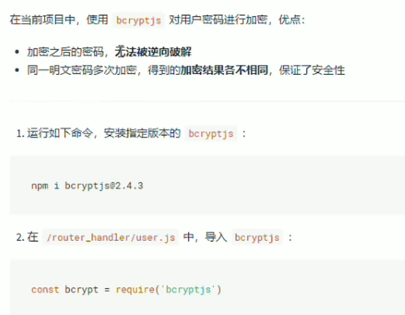
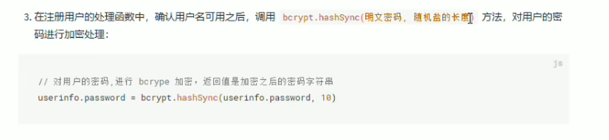
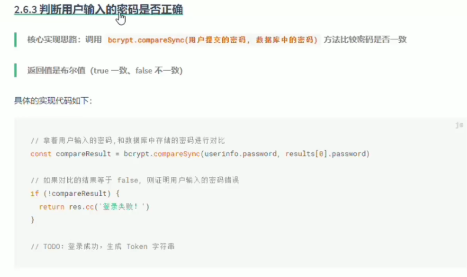

# 密码加密 bcryptjs

### bcryptjs包进行加密
  

### 安装
```sh
npm i bcryptjs
```
### 引入
```js
const bcrypt = require('bcryptjs')
```


### 加密 bcrypt.hashSync()
  

```js
let password = bcrypt.hashSync(req.body.password,10)
```
###  解密 bcrypt.compareSync()
  

```js
bcrypt.compareSync()
```

::: danger 重温一下上一章最后说的过程👇
1. 【用户注册】：前端验证账号和密码是否合规
2. 后端接收到后也验证一次，然后把【用户名】存入数据库
3. 【密码】通过【🔒bcryptjs加密】后也存入数据库
4. 把【随机盐】也存入数据库，当然，比较懒也可以用【固定盐】
5. 然后这相当于【注册成功】。
6. 在【注册成功】和【登录成功】后都需要给用户生成一个【Token】
7. 【登录】的话，用户提供用户名和密码
8. 先去数据库查看是否有这个【用户名】，如果没有就告知【密码错误】或【此用户名不存在】
9. 如果有此用户就把它的【加密过的密码】拿出来。
10. 利用`bcrypt.compareSync(用户登录时传来的密码,数据库里加密的密码)`里的方法进行比对。如果密码比对正确，就会返回`True`
11. 这时候就算登录成功，可以给用户返回一个`Token`以及相关的用户信息。
12. 这个【Token】是会保存在用户的浏览器客户端的，如果【过期】了就会失效。所以要设置好过期的【重新登录】
:::
