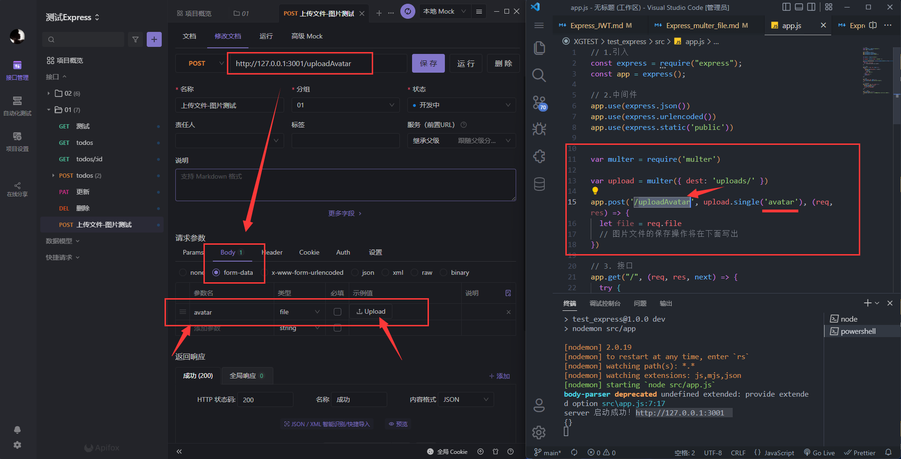
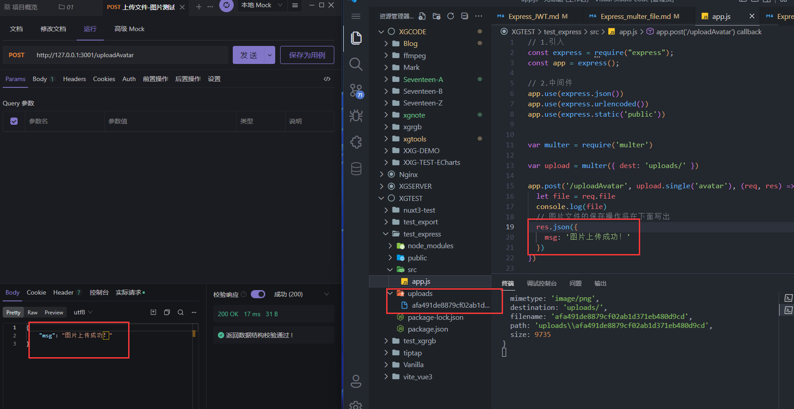

# multer 上传文件/图像

- 上传完文件/图像/头像，想要【访问】得用上面章节的【static静态资源】
###  multer是什么？
multer是一个能更好的处理node.js服务器接收的文件上传的中间件

> [multer中文文档](https://github.com/expressjs/multer/blob/master/doc/README-zh-cn.md)
### 安装
```sh
npm i multer
```
### 配置
这里是最简单的配置，指明二进制文件保存至【根目录下的uploads文件夹】内
```javascript
let multer = require('multer')

let upload = multer({ dest: 'uploads/' })
```
### 单图上传

1. `upload` 就是上文的multer的配置对象
1. `single` 中的字符串要对应上传input的 `name` 或者是对应`formdata`的键名（后面示范就明白了）
```javascript
app.post('/uploadAvatar', upload.single('avatar'), (req, res) => {
    let file = req.file
    // 图片文件的保存操作将在下面写出
})
```
> 如果图片太小，就右键图片去【在新标签页中打开图像】看！  


  
  

此时，图片是二进制的....  我们需要在保存进来的时候，把它改成jpg或png格式才可以查看哦~

### 图片打不开,要拼接保存路径！👇
-  `file.originalname` 是上传的源图片的名字 比如 cxc.png 
-  `originalArr[originalArr.length - 1]` 是把后缀名提取出来
-  `file.filename` 是文件的名字，不包括后缀的名字
```javascript
const multer = require('multer')//文件上传
const fs = require('fs')

let uploadImg = multer({ dest: 'uploads/' })
app.post('/uploadAvatar', uploadImg.single('avatar'), (req, res) => {
    let file = req.file
    console.log(file)

    //【保存图片到文件夹】
    let originalArr = file.originalname.split('.') //分割[xx.png]
    let type = originalArr[originalArr.length - 1]//png 或者jpg
    // 读取文件 ( path, 'utf-8'【这里不写解码类型,直接把回调函数中的data写入新文件即可】, callback)
    fs.readFile(file.path, (err, data) => {
        if (err) throw err

        // 创建复制图片的路径 以及 拼接type形成一个完整的图片文件
        let newPath = 'uploads/' + file.filename + "." + type

        // 写入复制的图片 (path, data, callback)
        fs.writeFile( newPath, data, (error) => { // 把读取到的data写入
            if (error) throw error
        })
        // 删除原uploads路径下的图片
        fs.unlink('uploads/' + file.filename, () => {
            console.log('图片已删除')
        })
    })
})
```

## 关于上传头像 🤩
- 后端保存头像图片跟保存其他图片是一样的
- 前端上传图片/文件需要设置`form-data`的参数名，以及裁切正方形图片
::: danger 确保一个用户只会保存一张头像
1. 每次用户上传就将头像路径和id绑定，
2. 同一用户再次上传时就先根据前一次绑定的头像路径将该图片删除
3. 再将新头像路径绑定到对应id。

以此反复，保证服务器上每个用户只会保存一张头像图片。
:::
