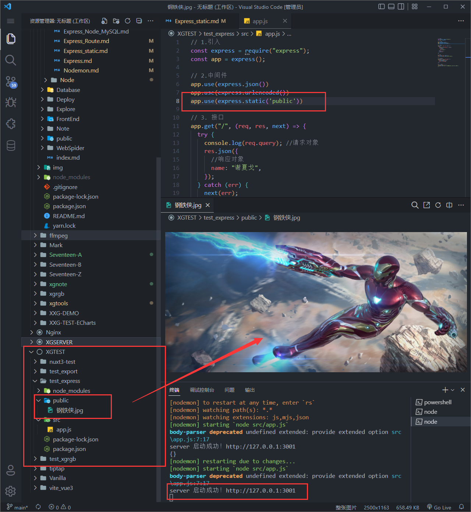
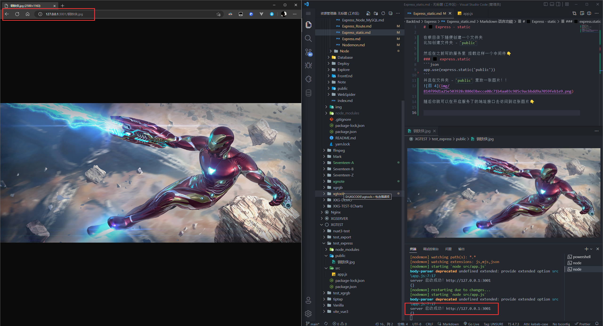

# static 静态资源

### express.static
使用 express.static 中间件可以让你访问到静态资源！

在根目录下随便创建一个文件夹，比如创建文件夹 - `public`

然后在之前写的服务里 挂载这样一个中间件👇
```js
app.use(express.static('public'))
```
整体👇
```javascript
//app.js
//1.引入...

//2.中间件/跨域/静态资源
//...
app.use(express.static('public'))

//3.接口服务
//4.404
//5.错误捕获
//6.服务开启！
```
**并且在文件夹 - `public` 里放一张图片！！**

  

随后你就可以在开启服务了的地址接口去访问到这张图片👇

  
