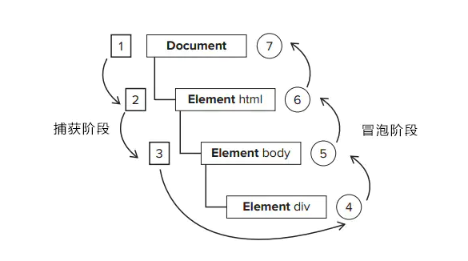

::: tip Javascript 篇
灵感，是由于顽强的劳动而获得的奖赏。
:::
# ✨ DOM ✨

## 说一下 DOM 事件流

又称为事件传播，是页面中接收事件的顺序。DOM2 级事件规定的事件流包括了3个阶段：
- 事件捕获阶段（capture phase）
- 处于目标阶段（target phase）
- 事件冒泡阶段（bubbling phase）


如上图所示，事件流的触发顺序是：
1. 事件捕获阶段，为截获事件提供了机会
2. 实际的目标元素接收到事件
3. 事件冒泡阶段，可在这个阶段对事件做出响应

## 什么是事件冒泡（Event Bubbling）
事件开始由最具体的元素（文档中嵌套层次最深的那个节点）接收到后，开始逐级向上传播到较为不具体的节点。
```html
<html>
  <head>
    <title>Document</title>
  </head>
  <body>
    <button>按钮</button>
  </body>
</html>
```
如果点击了上面页面代码中的 `<button>` 按钮，那么该 click 点击事件会沿着 DOM 树向上逐级传播，在途经的每个节点上都会发生，具体顺序如下：
1. button 元素
1. body 元素
1. html 元素
1. document 对象

## 什么是事件捕获（Event Capturing）

事件开始由较为不具体的节点接收后，然后开始逐级向下传播到最具体的元素上。

事件捕获的最大作用在于：事件在到达预定⽬标之前就可以捕获到它。

如果仍以上面那段 HTML 代码为例，当点击按钮后，在事件捕获的过程中，document 对象会首先接收到这个 click 事件，然后再沿着 DOM 树依次向下，直到 `<button>`。具体顺序如下：
1. document 对象
1. html 元素
1. body 元素
1. button 元素

## 什么是事件委托

事件委托，就是利用了事件冒泡的机制，在较上层位置的元素上添加一个事件监听函数，来管理该元素及其所有子孙元素上的某一类的所有事件。

适用场景：在绑定大量事件的时候，可以选择事件委托

优点

- 事件委托可以减少事件注册数量，节省内存占⽤!
- 当新增⼦元素时，⽆需再次做事件绑定，因此非常适合动态添加元素（vue 解析模板时, 会对新创建的元素, 额外进行绑定的）

## 什么是 DOM
DOM 就是文档对象模型 ，是用来呈现以及与任意 HTML 和或 XML 文档交互的 API

它提供了对文档的结构化的表述，并定义了一种方式可以使从程序中对该结构进行访问，从而改变文档的结构，样式和内容

## DOM 的常用操作

### 创建节点

`createElement` 创建新元素，接受一个参数，即要创建元素的标签名
```js
const divEl = document.createElement("div");
```
`createTextNode` 创建一个文本节点
```js
const textEl = document.createTextNode("content");
```
`createDocumentFragment` 用来创建一个文档碎片，它表示一种轻量级的文档，主要是用来存储临时节点，然后把文档碎片的内容一次性添加到 DOM 中
```js
const fragment = document.createDocumentFragment();
```
当请求把一个 DocumentFragment 节点插入文档树时，插入的不是 DocumentFragment 自身，而是它的所有子孙节点

`createAttribute` 创建属性节点，可以是自定义属性
```js
const dataAttribute = document.createAttribute('custom');
consle.log(dataAttribute);
```
### 获取节点
`querySelector` 传入任何有效的 CSS 选择器，即可选中单个 DOM 元素（首个）
```js
document.querySelector('.element')
document.querySelector('#element')
document.querySelector('div')
document.querySelector('[name="username"]')
document.querySelector('div + p > span')
```
如果页面上没有指定的元素时，返回 null

`querySelectorAll` 返回一个包含节点子树内所有与之相匹配的 Element 节点列表，如果没有相匹配的，则返回一个空节点列表
```js
const notLive = document.querySelectorAll("p");
```
需要注意的是，该方法返回的是一个 NodeList 的静态实例，它是一个静态的“快照”，而非“实时”的查询

关于获取 DOM 元素的方法还有如下，就不一一述说
```js
document.getElementById('id属性值'); // 返回拥有指定 id 的对象的引用
document.getElementsByClassName('class属性值'); // 返回拥有指定 class 的对象集合
document.getElementsByTagName('标签名'); // 返回拥有指定标签名的对象集合
document.getElementsByName('name属性值'); // 返回拥有指定名称的对象结合
document/element.querySelector('CSS选择器'); // 仅返回第一个匹配的元素
document/element.querySelectorAll('CSS选择器'); // 返回所有匹配的元素
document.documentElement; // 获取页面中的 HTML 标签
document.body; // 获取页面中的 BODY 标签
document.all['']; // 获取页面中的所有元素节点的对象集合型
```

### 更新节点
`innerHTML` 不但可以修改一个 DOM 节点的文本内容，还可以直接通过 HTML 片段修改 DOM 节点内部的子树
```js
// 获取<p id="p">...</p >
var p = document.getElementById('p');
// 设置文本为abc:
p.innerHTML = 'ABC'; // <p id="p">ABC</p >
// 设置HTML:
p.innerHTML = 'ABC <span style="color:red">RED</span> XYZ';
// <p>...</p >的内部结构已修改
```

`innerText、textContent` 自动对字符串进行 HTML 编码，保证无法设置任何 HTML 标签
```js
// 获取<p id="p-id">...</p >
var p = document.getElementById('p-id');
// 设置文本:
p.innerText = '<script>alert("Hi")</script>';
// HTML被自动编码，无法设置一个<script>节点:
// <p id="p-id">&lt;script&gt;alert("Hi")&lt;/script&gt;</p>
```
两者的区别在于读取属性时，innerText 不返回隐藏元素的文本，而 textContent 返回所有文本

`style` DOM 节点的 style 属性对应所有的 CSS，可以直接获取或设置。遇到-需要转化为驼峰命名
```js
// 获取<p id="p-id">...</p >
const p = document.getElementById('p-id');
// 设置CSS:
p.style.color = '#ff0000';
p.style.fontSize = '20px'; // 驼峰命名
p.style.paddingTop = '2em';
```

### 添加节点
`innerHTML` 如果这个 DOM 节点是空的，例如，<div></div>，那么，直接使用 innerHTML = '<span>child</span>' 就可以修改 DOM 节点的内容，相当于添加了新的 DOM 节点

如果这个 DOM 节点不是空的，那就不能这么做，因为 innerHTML 会直接替换掉原来的所有子节点

`appendChild` 把一个子节点添加到父节点的最后一个子节点

如果是获取 DOM 元素后再进行添加操作，这个 js 节点是已经存在当前文档树中，因此这个节点首先会从原先的位置删除，再插入到新的位置

如果动态添加新的节点，则先创建一个新的节点，然后插入到指定的位置

`insertBefore` 把子节点插入到指定的位置，使用方法如下：
```js
parentElement.insertBefore(newElement, referenceElement)
```
子节点会插入到 referenceElement 之前

`setAttribute` 添加一个属性节点，如果元素中已有该属性改变属性值
```js
const div = document.getElementById('id')
div.setAttribute('class', 'white'); // 第一个参数属性名，第二个参数属性值。
```

### 删除节点
`removeChild` 删除一个节点，首先要获得该节点本身以及它的父节点，然后，调用父节点的 removeChild 把自己删掉
```js
// 拿到待删除节点:
const self = document.getElementById('to-be-removed');
// 拿到父节点:
const parent = self.parentElement;
// 删除:
const removed = parent.removeChild(self);
removed === self; // true
```
删除后的节点虽然不在文档树中了，但其实它还在内存中，可以随时再次被添加到别的位置

## 什么是 DOM 树
以 HTMLDocument 为根节点，其余节点为子节点，组织成一个树的数据结构的表示就是 DOM 树。

DOM 树直接体现了标签与标签之间的关系

## 什么是 DOM 对象，什么是 document 对象
DOM 对象是浏览器根据 html 标签生成的 JS 对象

docement 对象是 DOM 里提供的一个对象，它提供的属性和方法都是用来访问和操作网页内容的

## 怎么解绑事件
on事件方式，直接使用null覆盖就可以实现事件解绑

语法：
```js
// 绑定事件
btn.onclick = function(){
  alert('点击了')
}
//解绑事件
btn.onclick = null
```
addEventListener方式，必须使用：removeEventListener(事件类型,事件处理函数，[获取捕获或者冒泡阶段])例如:
```js
function fn(){
  alert('点击了')
}
// 绑定事件
btn.addEventListener('click',fn)
//解绑事件
btn.removeEventListener('click',fn)
```
:::warning 注意
匿名函数无法被解绑
:::

## addEventListener 的第三个参数有什么用
addEventListener 有三个参数：
```js
element.addEventListener(event, function, useCapture)
```
参数|描述
:-:|:-
event|	必须。字符串，指定事件名。 注意: 不要使用 "on" 前缀。 例如，使用 "click" ，而不是使用 "onclick"。 提示：所有 HTML DOM 事件，可以查看我们完整的 HTML DOM Event 对象参考手册。
function|	必须。指定要事件触发时执行的函数。 当事件对象会作为第一个参数传入函数。 事件对象的类型取决于特定的事件。例如，"click" 事件属于 MouseEvent（鼠标事件）对象。
useCapture|	可选。布尔值，指定事件是否在捕获或冒泡阶段执行。 可能值 :true - 事件句柄在捕获阶段执行（即在事件捕获阶段调用处理函数）false- false- 默认。事件句柄在冒泡阶段执行（即表示在事件冒泡的阶段调用事件处理函数）

##  常用 DOM 事件
- 鼠标事件
  1. mouseover/mouseout：支持冒泡
  1. mouseenter/mouseleave：不支持冒泡
  1. 鼠标单击 click
  1. 鼠标双击 dblclick
  1. 鼠标移入/移出
  1. 鼠标移动 mousemove
  1. 鼠标按下 mousedown
  1. 鼠标松开 mouseup

- 键盘事件
  1. input：键盘输入
  1. keydwon：键盘按下
  1. focus：成为焦点
  1. blur：失去焦点

- 页面事件
  1. scroll：页面滚动
  1. resize：页面大小变化

## 怎么阻止事件冒泡、阻止默认事件？
阻止事件冒泡 `e.stopPropagation()`

阻止默认事件，3 种方式
```js
e.preventDefault(); // 谷歌及 IE8 以上
window.event.returnValue = false; // IE8 及以下
return false; // 无兼容问题（但不能用于节点直接 onclick 绑定函数）
```

## DOM 的类型有哪几种？
总共有 12 种类型
```js
元素节点            　　Node.ELEMENT_NODE(1)
属性节点            　　Node.ATTRIBUTE_NODE(2)
文本节点            　　Node.TEXT_NODE(3)
CDATA 节点             Node.CDATA_SECTION_NODE(4)
实体引用名称节点    　　 Node.ENTRY_REFERENCE_NODE(5)
实体名称节点        　　Node.ENTITY_NODE(6)
处理指令节点        　　Node.PROCESSING_INSTRUCTION_NODE(7)
注释节点            　 Node.COMMENT_NODE(8)
文档节点            　 Node.DOCUMENT_NODE(9)
文档类型节点        　　Node.DOCUMENT_TYPE_NODE(10)
文档片段节点        　　Node.DOCUMENT_FRAGMENT_NODE(11)
DTD 声明节点            Node.NOTATION_NODE(12)
```

##  DOM 中获取坐标的属性有哪些，它们有什么不同？
属性|说明|兼容性
:-:|:-:|:-:
offsetX|以当前的目标元素左上角为原点，定位 x 轴坐标|除 Mozilla 外都兼容
offsetY|以当前的目标元素左上角为原点，定位 y 轴坐标|除 Mozilla 外都兼容
clientX|以浏览器可视窗口左上角为原点，定位 x 轴坐标|都兼容
clientY|以浏览器可视窗口左上角为原点，定位 y 轴坐标|都兼容
pageX|以 doument 对象左上角为原点，定位 x 轴坐标|除IE外都兼容
pageY|以 doument 对象左上角为原点，定位 y 轴坐标|除IE外都兼容
screenX|以计算机屏幕左上顶角为原点，定位 x 轴坐标(多屏幕会影响)	|全兼容
screenY|以计算机屏幕左上顶角为原点，定位 y 轴坐标|全兼容
layerX|最近的绝对定位的父元素（如果没有，则为 document 对象）左上顶角为元素，定位 x 轴坐标|Mozilla 和 Safari
layerY|最近的绝对定位的父元素（如果没有，则为 document 对象）左上顶角为元素，定位 y 轴坐标|Mozilla 和 Safari

## DOM 中元素视图尺寸的属性有哪些？

属性|说明
:-:|:-:
offsetLeft|获取当前元素到定位父节点的 left 方向的距离
offsetTop|获取当前元素到定位父节点的 top 方向的距离
offsetWidth|获取当前元素 width + 左右 padding + 左右 border-width
offsetHeight|获取当前元素 height + 上下 padding + 上下 border-width
clientWidth|获取当前元素 width + 左右 padding
clientHeight|获取当前元素 height + 上下 padding
scrollWidth|当前元素内容真实的宽度，内容不超出盒子宽度时为盒子的 clientWidth
scrollHeight|当前元素内容真实的高度，内容不超出盒子高度时为盒子的 clientHeight

## 如何判断元素是否在可视区域
- getBoundingClientRect
Element.getBoundingClientRect() 方法返回元素的大小及其相对于视口的位置。返回的是一个对象，对象里有这 8 个属性：left，right，top，bottom，width，height，x，y

##  如何遍历输出页面中的所有元素
- createNodeIterator
使用 createNodeIterator 对页面中所有元素进行遍历输出呢？
```js
const body = document.getElementsByTagName('body')[0]
const it = document.createNodeIterator(body)
let root = it.nextNode()
while(root) {
  console.log(root)
  root = it.nextNode()
}
```