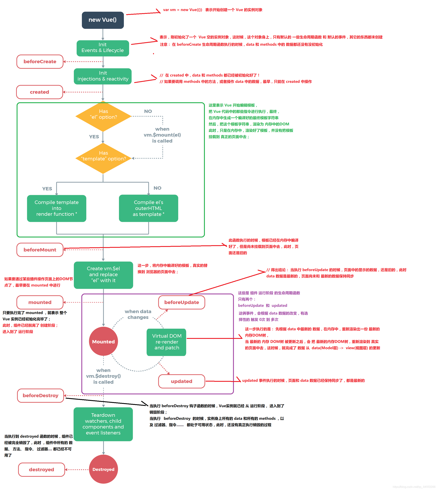
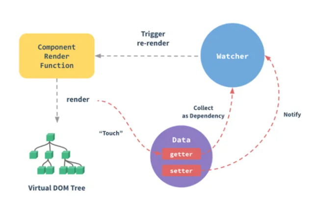

::: tip Vue 篇
世上最重要的事，不在于我们在何处，而在于我们朝着什么方向走。
:::
# ✨ Vue ✨
## Vue的优点
- 轻量级框架：只关注视图层，是一个构建数据的视图集合，大小只有几十 kb ；
- 简单易学：国人开发，中文文档，不存在语言障碍 ，易于理解和学习；
- 双向数据绑定：保留了 angular 的特点，在数据操作方面更为简单；
- 组件化：保留了 react 的优点，实现了 html 的封装和重用，在构建单页面应用方面有着独特的优势；
- 视图，数据，结构分离：使数据的更改更为简单，不需要进行逻辑代码的修改，只需要操作数据就能完成相关操作；
- 虚拟DOM：dom 操作是非常耗费性能的， 不再使用原生的 dom 操作节点，极大解放 dom 操作，但具体操作的还是 dom 不过是换了另一种方式；
- 运行速度更快：相比较于 react 而言，同样是操作虚拟 dom ，就性能而言， vue 存在很大的优势。
- 
## 说说vue的生命周期的理解
生命周期通俗说就是Vue实例从创建到销毁的过程，就是生命周期。<br>
`beforecreate` （初始化界面前）<br>
`created` （初始化界面后）<br>
`beforemount` （渲染界面前）<br>
`mounted` （渲染界面后）<br>
`beforeUpdate` （更新数据前）<br>
`updated` （更新数据后）<br>
`beforedestory` （卸载组件前）<br>
`destroyed` （卸载组件后）<br>
注意：面试官想听到的不只是你说出了以上八个钩子名称，而是每个阶段做了什么？可以收藏下图！


## 第一次页面加载会触发哪几个钩子？
第一次页面加载时会触发 `beforeCreate`, `created`, `beforeMount`, `mounted` 这几个钩子

##  ref、 shallowRef 、isRef、toRefs 函数

### ref
ref() 函数用来根据给定的值创建一个响应式的数据对象，ref() 函数调用的返回值是一个对象，这个对象上只包含一个 value 属性, 只在 setup 函数内部访问 ref 函数需要加 .value，其用途创建独立的原始值

reactive 将解包所有深层的 refs，同时维持 ref 的响应性。当将 ref分配给 reactive property 时，ref 将被自动解包
### shallowRef
ref() 的浅层作用形式。shallowRef() 常常用于对大型数据结构的性能优化或是与外部的状态管理系统集成

### isRef
isRef() 用来判断某个值是否为 ref() 创建出来的对象
### toRefs
使用场景：如果对一个响应数据，进行解构 或者 展开，会丢失他的响应式特性!<br>
原因：vue3 底层是对 对象 进行监听劫持<br>
作用：对一个响应式对象的所有内部属性，都做响应式处理
- reactive/ref 的响应式功能是赋值给对象的，如果给对象解构或者展开，会让数据丢失响应式的能力
- 使用 toRefs 可以保证该对象展开的每个属性都是响应式的

## 说说你对SPA单页面的理解，它的优缺点分别是什么？
SPA（ single page application ）仅在 Web 页面初始化时加载相应的 HTML、JavaScript 和 CSS。

一旦页面加载完成，SPA 不会因为用户的操作而进行页面的重新加载或跳转

而页面的变化是利用路由机制实现 HTML 内容的变换，避免页面的重新加载。

优点

- 用户体验好，内容的改变不需要重新加载整个页面，避免了不必要的跳转和重复渲染
- 减少了不必要的跳转和重复渲染，这样相对减轻了服务器的压力
- 前后端职责分离，架构清晰，前端进行交互逻辑，后端负责数据处理

缺点

- 初次加载耗时多
- 不能使用浏览器的前进后退功能，由于单页应用在一个页面中显示所有的内容，所以，无法前进后退
- 不利于搜索引擎检索：由于所有的内容都在一个页面中动态替换显示，所以在 SEO 上其有着天然的弱势。

## SPA首屏加载速度慢的怎么解决？
首屏时间（First Contentful Paint），指的是浏览器从响应用户输入网址地址，到首屏内容渲染完成的时间，此时整个网页不一定要全部渲染完成，但需要展示当前视窗需要的内容；

加载慢的原因

- 网络延时问题
- 资源文件体积是否过大
- 资源是否重复发送请求去加载了
- 加载脚本的时候，渲染内容堵塞了

常见的几种SPA首屏优化方式

- 减小入口文件积
- 静态资源本地缓存
- UI框架按需加载
- 图片资源的压缩
- 组件重复打包
- 开启GZip压缩
- 使用SSR
想要具体了解可以点击[SPA（单页应用）首屏加载速度慢的解决详解](https://blog.csdn.net/weixin_44475093/article/details/110675962)

## 对MVVM的理解？
MVVM 由 Model、View、ViewModel 三部分构成，Model 层代表数据模型，也可以在Model中定义数据修改和操作的业务逻辑；View 代表UI 组件，它负责将数据模型转化成UI 展现出来；ViewModel 是一个同步View 和 Model的对象。

在MVVM架构下，View 和 Model 之间并没有直接的联系，而是通过ViewModel进行交互，Model 和 ViewModel 之间的交互是双向的， 因此View 数据的变化会同步到Model中，而Model 数据的变化也会立即反应到View 上。

ViewModel 通过双向数据绑定把 View 层和 Model 层连接了起来，而View 和 Model 之间的同步工作完全是自动的，无需人为干涉，因此开发者只需关注业务逻辑，不需要手动操作DOM， 不需要关注数据状态的同步问题，复杂的数据状态维护完全由 MVVM 来统一管理。

## Vue数据双向绑定原理

实现mvvm的数据双向绑定，是采用数据劫持结合发布者-订阅者模式的方式，通过Object.defineProperty()来给各个属性添加setter，getter并劫持监听，在数据变动时发布消息给订阅者，触发相应的监听回调。就必须要实现以下几点：

1. 实现一个数据监听器Observer，能够对数据对象的所有属性进行监听，如有变动可拿到最新值并通知订阅者
2. 实现一个指令解析器Compile，对每个元素节点的指令进行扫描和解析，根据指令模板替换数据，以及绑定相应的更新函数
3. 实现一个Watcher，作为连接Observer和Compile的桥梁，能够订阅并收到每个属性变动的通知，执行指令绑定的相应回调函数，从而更新视图


## Vue的响应式原理
什么是响应式，也即是说，数据发生改变的时候，视图会重新渲染，匹配更新为最新的值。

Object.defineProperty 为对象中的每一个属性，设置 get 和 set 方法，每个声明的属性，都会有一个 专属的依赖收集器 subs，当页面使用到 某个属性时，触发 ObjectdefineProperty - get函数，页面的 watcher 就会被 放到 属性的依赖收集器 subs 中，在 数据变化时，通知更新；

当数据改变的时候，会触发Object.defineProperty - set函数，数据会遍历自己的 依赖收集器 subs，逐个通知 watcher，视图开始更新；

## Vue3.x响应式数据原理
Vue3.x改用Proxy替代Object.defineProperty。
因为Proxy可以直接监听对象和数组的变化，并且有多达13种拦截方法。并且作为新标准将受到浏览器厂商重点持续的性能优化。

Proxy只会代理对象的第一层，Vue3是怎样处理这个问题的呢？

判断当前Reflect.get的返回值是否为Object，如果是则再通过reactive方法做代理， 这样就实现了深度观测。

监测数组的时候可能触发多次get/set，那么如何防止触发多次呢？我们可以判断key是否为当前被代理对象target自身属性，也可以判断旧值与新值是否相等，只有满足以上两个条件之一时，才有可能执行trigger。

## Vue3.0 里为什么要用 Proxy API替代 defineProperty API？
1. defineProperty API 的局限性最大原因是它只能针对单例属性做监听。
Vue2.x中的响应式实现正是基于defineProperty中的descriptor，对 data 中的属性做了遍历 + 递归，为每个属性设置了 getter、setter。这也就是为什么 Vue 只能对 data 中预定义过的属性做出响应的原因。
2. Proxy API的监听是针对一个对象的，那么对这个对象的所有操作会进入监听操作， 这就完全可以代理所有属性，将会带来很大的性能提升和更优的代码。
Proxy 可以理解成，在目标对象之前架设一层“拦截”，外界对该对象的访问，都必须先通过这层拦截，因此提供了一种机制，可以对外界的访问进行过滤和改写。
3. 响应式是惰性的。
在 Vue.js 2.x 中，对于一个深层属性嵌套的对象，要劫持它内部深层次的变化，就需要递归遍历这个对象，执行 Object.defineProperty 把每一层对象数据都变成响应式的，这无疑会有很大的性能消耗。
在 Vue.js 3.0 中，使用 Proxy API 并不能监听到对象内部深层次的属性变化，因此它的处理方式是在 getter 中去递归响应式，这样的好处是真正访问到的内部属性才会变成响应式，简单的可以说是按需实现响应式，减少性能消耗。

## Proxy 与 Object.defineProperty 优劣对比
1. Proxy 可以直接监听对象而非属性；
2. Proxy 可以直接监听数组的变化；
3. Proxy 有多达 13 种拦截方法,不限于 apply、ownKeys、deleteProperty、has 等等是 Object.defineProperty 不具备的；
4. Proxy 返回的是一个新对象,我们可以只操作新的对象达到目的,而 Object.defineProperty 只能遍历对象属性直接修改；
5. Proxy 作为新标准将受到浏览器厂商重点持续的性能优化，也就是传说中的新标准的性能红利；
6. Object.defineProperty 的优势如下:
兼容性好，支持 IE9，而 Proxy 的存在浏览器兼容性问题,而且无法用 polyfill 磨平，因此 Vue 的作者才声明需要等到下个大版本( 3.0 )才能用 Proxy 重写。

## vue中组件的data为什么是一个函数？而new Vue 实例里，data 可以直接是一个对象
我们知道，Vue组件其实就是一个Vue实例。

JS中的实例是通过构造函数来创建的，每个构造函数可以new出很多个实例，那么每个实例都会继承原型上的方法或属性。

Vue的data数据其实是Vue原型上的属性，数据存在于内存当中。Vue为了保证每个实例上的data数据的独立性，规定了必须使用函数，而不是对象。

因为使用对象的话，每个实例（组件）上使用的data数据是相互影响的，这当然就不是我们想要的了。对象是对于内存地址的引用，直接定义个对象的话组件之间都会使用这个对象，这样会造成组件之间数据相互影响。

使用函数后，使用的是data()函数，data()函数中的this指向的是当前实例本身，就不会相互影响了。

而 new Vue 的实例，是不会被复用的，因此不存在引用对象的问题。

## vue中data的属性可以和methods中方法同名吗，为什么？
可以同名，methods的方法名会被data的属性覆盖；调试台也会出现报错信息，但是不影响执行；

原因：源码定义的initState函数内部执行的顺序：props>methods>data>computed>watch
```js
//initState部分源码
export function initState (vm: Component) {
  vm._watchers = []
  const opts = vm.$options
  if (opts.props) initProps(vm, opts.props)
  if (opts.methods) initMethods(vm, opts.methods)
  if (opts.data) {
    initData(vm)
  } else {
    observe(vm._data = {}, true /* asRootData */)
  }
  if (opts.computed) initComputed(vm, opts.computed)
  if (opts.watch && opts.watch !== nativeWatch) {
    initWatch(vm, opts.watch)
  }   
}
```

## vue中created与mounted区别
在created阶段，实例已经被初始化，但是还没有挂载至el上，所以我们无法获取到对应的节点，但是此时我们是可以获取到vue中data与methods中的数据的；
在mounted阶段，vue的template成功挂载在$el中，此时一个完整的页面已经能够显示在浏览器中，所以在这个阶段，可以调用节点了；
```js
//以下为测试vue部分生命函数，便于理解
beforeCreate(){  //创建前
    console.log('beforecreate:',document.getElementById('first'))//null
    console.log('data:',this.text);//undefined
    this.sayHello();//error:not a function
},
created(){  //创建后
    console.log('create:',document.getElementById('first'))//null
    console.log('data:',this.text);//this.text
    this.sayHello();//this.sayHello()
},
beforeMount(){ //挂载前
    console.log('beforeMount:',document.getElementById('first'))//null
    console.log('data:',this.text);//this.text
    this.sayHello();//this.sayHello()
},
mounted(){  //挂载后
    console.log('mounted:',document.getElementById('first'))//<p></p>
    console.log('data:',this.text);//this.text
    this.sayHello();//this.sayHello()
}
```

## Vue中computed与method的区别
相同点:

如果作为模板的数据显示，二者能实现响应的功能，唯一不同的是methods定义的方法需要执行

不同点：

1. computed 会基于响应数据缓存，methods不会缓存；
2. diff之前先看data里的数据是否发生变化，如果没有变化computed的方法不会执行，但methods里的方法会执行
3. computed是属性调用，而methods是函数调用

## 虚拟DOM中key的作用
简单的说：key是虚拟DOM对象的标识，在更新显示时key起着极其重要的作用。
复杂的说：当状态中的数据发生了变化时，react会根据【新数据】生成【新的虚拟DOM】，随后React进行【新虚拟DOM】与【旧虚拟DOM】的diff比较，比较规则如下：

- 旧虚拟DOM中找到了与新虚拟DOM相同的key
  1. 若虚拟DOM中的内容没有变，直接使用之前的真是DOM
  2. 若虚拟DOM中内容变了，则生成新的真实DOM，随后替换掉页面中之前的真实DOM
- 旧虚拟DOM中未找到与新虚拟DOM相同的key
  1. 根据数据创建新的真实DOM，随后渲染到页面

## 用index作为key可能会引发的问题
- 若对数据进行：逆序添加/逆序删除等破坏顺序的操作，会产生没有必要的真实DOM更新，界面效果虽然没有问题，但是数据过多的话，会效率过低；
- 如果结构中还包含输入类的DOM，会产生错误DOM更新，界面有问题；
- 注意！如果不存在对数据的逆序操作，仅用于渲染表用于展示，使用index作为key是没有问题的。

## Vue中watch用法详解
在vue中，使用watch来监听数据的变化；

1. 监听的数据后面可以写成对象形式，包含handler方法，immediate和deep。
2. immediate表示在watch中首次绑定的时候，是否执行handler，值为true则表示在watch中声明的时候，就立即执行handler方法，值为false，则和一般使用watch一样，在数据发生变化的时候才执行handler。
3. 当需要监听一个对象的改变时，普通的watch方法无法监听到对象内部属性的改变，只有data中的数据才能够监听到变化，此时就需要deep属性对对象进行深度监听。

```js
watch: {
    name: {
      handler(newName, oldName) {
      
      },
      deep: true,
      immediate: true
    }
  } 
```

## vue中的插槽
点击[Vue中组件神兵利器，插槽Slot！](https://mp.weixin.qq.com/s/6sUvglxC25zEo_pGLVJHeQ)查看详解！

## $nextTick的理解

- 用法：

在下次 DOM 更新循环结束之后执行延迟回调。在修改数据之后立即使用这个方法，获取更新后的 DOM。
- 为什么？

Vue 实现响应式并不是数据发生变化之后 DOM 立即变化，而是按一定的策略进行 DOM 的更新。Vue 在更新 DOM 时是异步执行的。只要侦听到数据变化，Vue 将开启一个队列，并缓冲在同一事件循环中发生的所有数据变更。如果同一个 watcher 被多次触发，只会被推入到队列中一次。这种在缓冲时去除重复数据对于避免不必要的计算和 DOM 操作是非常重要的。然后，在下一个的事件循环“tick”中，Vue 刷新队列并执行实际 (已去重的) 工作。
所以为了在数据变化之后等待 Vue 完成更新 DOM，可以在数据变化之后立即使用 Vue.nextTick(callback)。这样回调函数将在 DOM 更新完成后被调用。

- 使用场景

在你更新完数据后，需要及时操作渲染好的 DOM时

## Vue中常用的一些指令
1. v-model指令：用于表单输入，实现表单控件和数据的双向绑定。
2. v-on：简写为@，基础事件绑定
3. v-bind：简写为：，动态绑定一些元素的属性，类型可以是：字符串、对象或数组。
4. v-if指令：取值为true/false，控制元素是否需要被渲染
5. v-else指令：和v-if指令搭配使用，没有对应的值。当v-if的值false，v-else才会被渲染出来。
6. v-show指令：指令的取值为true/false，分别对应着显示/隐藏。
7. v-for指令：遍历data中存放的数组数据，实现列表的渲染。
8. v-once： 通过使用 v-once 指令，你也能执行一次性地插值，当数据改变时，插值处的内容不会更新

## vue的自定义指令
Vue除了核心功能默认内置的指令 ，Vue 也允许注册自定义指令。

自定义指令是用来操作DOM的。尽管Vue推崇数据驱动视图的理念，但并非所有情况都适合数据驱动。自定义指令就是一种有效的补充和扩展，不仅可用于定义任何的DOM操作，并且是可复用的。

添加自定义指令的两种方式：

- 全局指令： 通过 Vue.directive() 函数注册一个全局的指令。
- 局部指令：通过组件的 directives 属性，对该组件添加一个局部的指令。

可以参考[Vue.js官网关于自定义指令的详细讲解](https://v2.cn.vuejs.org/v2/guide/custom-directive.html)学习

## v-show和v-if指令的共同点和不同点
- 相同点：v-show和v-if都能控制元素的显示和隐藏。
- 不同点：
  1. 实现本质方法不同:v-show本质就是通过设置css中的display设置为none;控制隐藏v-if是动态的向DOM树内添加或者删除DOM元素;
  2. v-show都会编译，初始值为false，只是将display设为none，但它也编译了;v-if初始值为false，就不会编译了

总结：v-show只编译一次，后面其实就是控制css，而v-if不停的销毁和创建，如果要频繁切换某节点时，故v-show性能更好一点。

## 为什么避免v-if和v-for一起使用
vue2.x版本中，当 v-if 与 v-for 一起使用时，v-for 具有比 v-if 更高的优先级；

vue3.x版本中，当 v-if 与 v-for 一起使用时，v-if 具有比 v-for 更高的优先级。

官网明确指出：避免 v-if 和 v-for 一起使用，永远不要在一个元素上同时使用 v-if 和 v-for。

可以先对数据在计算数据中进行过滤，然后再进行遍历渲染；

操作和实现起来都没有什么问题，页面也会正常展示。但是会带来不必要的性能消耗；

## vue为什么在 HTML 中监听事件？
你可能注意到这种事件监听的方式违背了关注点分离 (separation of concern) 这个长期以来的优良传统。但不必担心，因为所有的 Vue.js 事件处理方法和表达式都严格绑定在当前视图的 ViewModel 上，它不会导致任何维护上的困难。实际上，使用 v-on 或 @ 有几个好处：

- 扫一眼 HTML 模板便能轻松定位在 JavaScript 代码里对应的方法。
- 因为你无须在 JavaScript 里手动绑定事件，你的 ViewModel 代码可以是非常纯粹的逻辑，和 DOM 完全解耦，更易于测试。
- 当一个 ViewModel 被销毁时，所有的事件处理器都会自动被删除。你无须担心如何清理它们。

## Vue.set 改变数组和对象中的属性
在一个组件实例中，只有在data里初始化的数据才是响应的，Vue不能检测到对象属性的添加或删除，没有在data里声明的属性不是响应的,所以数据改变了但是不会在页面渲染；
解决办法：

使用 Vue.set(object, key, value) 方法将响应属性添加到嵌套的对象上

## vm.$set(obj, key, val) 做了什么？
由于 Vue 无法探测对象新增属性或者通过索引为数组新增一个元素，所以这才有了 vm.s e t ， 它 是 V u e . s e t 的 别 名 。 v m . set，它是 Vue.set 的别名。 vm.set，它是Vue.set的别名。vm.set 用于向响应式对象添加一个新的 property，并确保这个新的 property 同样是响应式的，并触发视图更新。

- 为对象添加一个新的响应式数据：调用 defineReactive 方法为对象增加响应式数据，然后执行 dep.notify 进行依赖通知，更新视图
- 为数组添加一个新的响应式数据：通过 splice 方法实现

## Vue组件通信有哪些方式
1. 父传子：props
父组件通过 props 向下传递数据给子组件。注：组件中的数据共有三种形式：data、props、computed
2. 父传子孙：provide 和 inject
父组件定义provide方法return需要分享给子孙组件的属性，子孙组件使用 inject 选项来接收指定的我们想要添加在这个实例上的 属性；
3. 子传父：通过事件形式
子组件通过 $emit()给父组件发送消息，父组件通过v-on绑定事件接收数据。
4. 父子、兄弟、跨级：eventBus.js
这种方法通过一个空的 Vue 实例作为中央事件总线（事件中心）,用它来（e m i t ） 触 发 事 件 和 （ emit）触发事件和（emit）触发事件和（on）监听事件，巧妙而轻量地实现了任何组件间的通信。
5. 通信插件：PubSub.js
6. vuex
vuex 是 vue 的状态管理器，存储的数据是响应式的。只需要把共享的值放到vuex中，其他需要的组件直接获取使用即可；

## router和route的区别
router为VueRouter的实例，相当于一个全局的路由器对象，里面含有很多属性和子对象，例如history对象。。。经常用的跳转链接就可以用this.$router.push，和router-link跳转一样。

route相当于当前正在跳转的路由对象。。可以从里面获取name,path,params,query等

## vue-router有几种钩子函数？
1. 全局路由
全局导航钩子主要有两种钩子：前置守卫(beforeEach)、后置钩子(afterEach)
2. 路由独享的钩子
单个路由独享的导航钩子，它是在路由配置上直接进行定义的
3. 组件内的导航钩子
组件内的导航钩子主要有这三种：beforeRouteEnter、beforeRouteUpdate、beforeRouteLeave。他们是直接在路由组件内部直接进行定义的。

详细知识点可以点击[路由导航守卫](https://router.vuejs.org/zh/guide/advanced/navigation-guards.html)查看；

## vue-router路由跳转方式
声明式（标签跳转）
```html
  <router-link :to="{name:'home'}"></router-link>
  <router-link :to="{path:'/home'}"></router-link>
```
编程式（ js跳转）
```js
this.$router.push('/home')
this.$router.push({name:'home'})
this.$router.push({path:'/home'})
```

## keep-alive了解吗
< keep-alive >是Vue的内置组件，能在组件切换过程中将状态保留在内存中，防止重复渲染DOM。

< keep-alive > 包裹动态组件时，会缓存不活动的组件实例，而不是销毁它们。

## Vuex是什么？怎么使用？
Vuex是实现组件全局状态（数据）管理的一种机制，可以方便实现组件数据之间的共享；Vuex集中管理共享的数据，易于开发和后期维护；能够高效的实现组件之间的数据共享，提高开发效率；存储在Vuex的数据是响应式的，能够实时保持页面和数据的同步；

Vuex重要核心属性包括：state,mutations,action,getters,modules.


`state` Vuex 使用单一状态树,即每个应用将仅仅包含一个store 实例，但单一状态树和模块化并不冲突。存放的数据状态，不可以直接修改里面的数据。

`mutations`定义的方法动态修改Vuex 的 store 中的状态或数据。

`actions`可以理解为通过将mutations里面处里数据的方法变成可异步的处理数据的方法，简单的说就是异步操作数据。view 层通过 store.dispath 来分发 action。

`getters` 类似vue的计算属性，主要用来过滤一些数据。

`modules` 项目特别复杂的时候，可以让每一个模块拥有自己的state、mutation、action、getters,使得结构非常清晰，方便管理。

## 什么情况下使用 Vuex？
如果应用够简单，最好不要使用 Vuex，一个简单的 store 模式即可；
需要构建一个中大型单页应用时，使用Vuex能更好地在组件外部管理状态；

## Vuex和单纯的全局对象有什么区别？
Vuex 的状态存储是响应式的。当 Vue 组件从 store 中读取状态的时候，若 store 中的状态发生变化，那么相应的组件也会相应地得到高效更新。

不能直接改变 store 中的状态。改变 store 中的状态的唯一途径就是显式地提交 (commit) mutation。这样使得我们可以方便地跟踪每一个状态的变化，从而让我们能够实现一些工具帮助我们更好地了解我们的应用。

## 为什么 Vuex 的 mutation 中不能做异步操作？
每个mutation执行完成后都会对应到一个新的状态变更，这样devtools就可以打个快照存下来，然后就可以实现 time-travel 了。如果mutation支持异步操作，就没有办法知道状态是何时更新的，无法很好的进行状态的追踪，给调试带来困难。

## axios 是什么，其特点和常用语法
1. Axios 是一个基于 promise 的 HTTP 库，可以用在浏览器和 node.js 中。前端最流行的 ajax 请求库，
1. react/vue 官方都推荐使用 axios 发 ajax 请求

特点:

1. 基于 promise 的异步 ajax 请求库，支持promise所有的API
1. 浏览器端/node 端都可以使用，浏览器中创建XMLHttpRequests
1. 支持请求／响应拦截器
1. 支持请求取消
1. 可以转换请求数据和响应数据，并对响应回来的内容自动转换成 JSON类型的数据
1. 批量发送多个请求
1. 安全性更高，客户端支持防御 XSRF，就是让你的每个请求都带一个从cookie中拿到的key, 根据浏览器同源策略，假冒的网站是拿不到你cookie中得key的，这样，后台就可以轻松辨别出这个请求是否是用户在假冒网站上的误导输入，从而采取正确的策略。

常用语法：

- `axios(config)`: 通用/最本质的发任意类型请求的方式
- `axios(url[, config])`: 可以只指定 url 发 get 请求
- `axios.request(config)`: 等同于 axios(config)
- `axios.get(url[, config])`: 发 get 请求
- `axios.delete(url[, config])`: 发 delete 请求
- `axios.post(url[, data, config])`: 发 post 请求
- `axios.put(url[, data, config])`: 发 put 请求
- `axios.defaults.xxx`: 请求的默认全局配置
- `axios.interceptors.request.use()`: 添加请求拦截器
- `axios.interceptors.response.use()`: 添加响应拦截器
- `axios.create([config])`: 创建一个新的 axios(它没有下面的功能)
- `axios.Cancel()`: 用于创建取消请求的错误对象
- `axios.CancelToken()`: 用于创建取消请求的 token 对象
- `axios.isCancel()`: 是否是一个取消请求的错误
- `axios.all(promises)`: 用于批量执行多个异步请求
- `axios.spread()`: 用来指定接收所有成功数据的回调函数的方法

## 对SSR有了解吗，它主要解决什么问题？
Server-Side Rendering 我们称其为SSR，意为服务端渲染指由服务侧完成页面的 HTML 结构拼接的页面处理技术，发送到浏览器，然后为其绑定状态与事件，成为完全可交互页面的过程；

解决了以下两个问题：

- seo：搜索引擎优先爬取页面HTML结构，使用ssr时，服务端已经生成了和业务想关联的HTML，有利于seo
- 首屏呈现渲染：用户无需等待页面所有js加载完成就可以看到页面视图（压力来到了服务器，所以需要权衡哪些用服务端渲染，哪些交给客户端）

缺点

- 复杂度：整个项目的复杂度
- 性能会受到影响
- 服务器负载变大，相对于前后端分离务器只需要提供静态资源来说，服务器负载更大，所以要慎重使用

## Vue要做权限管理该怎么做？控制到按钮级别的权限怎么做？
具体详解查看[Vue要做权限管理该怎么做？控制到按钮级别的权限怎么做](https://cloud.tencent.com/developer/article/1794300)

## 做过哪些Vue的性能优化？
编码阶段

- 尽量减少data中的数据，data中的数据都会增加getter和setter，会收集对应- 的watcher
- v-if和v-for不能连用
- 如果需要使用v-for给每项元素绑定事件时使用事件代理
- SPA 页面采用keep-alive缓存组件
- 在更多的情况下，使用v-if替代v-show
- key保证唯一
- 使用路由懒加载、异步组件
- 防抖、节流
- 第三方模块按需导入
- 长列表滚动到可视区域动态加载
- 图片懒加载

SEO优化

- 服务端渲染SSR
- 预渲染

打包优化

- 压缩代码
- Tree Shaking/Scope Hoisting
- 使用cdn加载第三方模块
- 多线程打包happypack
- splitChunks抽离公共文件
- sourceMap优化

## Vue3有了解过吗？能说说跟Vue2的区别吗？
具体详解请点击[Vue3有了解过吗？能说说跟Vue2的区别吗？](https://cloud.tencent.com/developer/article/1794328)

## Vue 3.0 所采用的 Composition Api 与 Vue 2.x使用的Options Api 有什么区别？

Options Api

- 包含一个描述组件选项（data、methods、props等）的对象 options；
API开发复杂组件，同一个功能逻辑的代码被拆分到不同选项 ；
使用mixin重用公用代码，也有问题：命名冲突，数据来源不清晰；

Composition Api

- vue3 新增的一组 api，它是基于函数的 api，可以更灵活的组织组件的逻辑。<br>解决options api在大型项目中，options api不好拆分和重用的问题。

## Vue3 Diff 算法和 Vue2 的区别
我们知道在数据变更触发页面重新渲染，会生成虚拟 DOM 并进行 patch 过程，这一过程在 Vue3 中的优化有如下

编译阶段的优化：

- 事件缓存：将事件缓存（如: @click），可以理解为变成静态的了
- 静态提升：第一次创建静态节点时保存，后续直接复用
- 添加静态标记：给节点添加静态标记，以优化 Diff 过程

由于编译阶段的优化，除了能更快的生成虚拟 DOM 以外，还使得 Diff 时可以跳过"永远不会变化的节点"，

Diff 优化如下

- Vue2 是全量 Diff，Vue3 是静态标记 + 非全量 Diff
- 使用最长递增子序列优化了对比流程

根据尤大公布的数据就是 Vue3 update 性能提升了 1.3~2 倍

## composition API 与 options API 的区别
1. vue2 采用的就是 optionsAPI
   - 优点：易于学习和使用，每个代码有着明确的位置 (例如：数据放 data 中，方法放 methods 中)
   - 缺点：相似的逻辑，不容易复用，在大项目中尤为明显
   - 虽然 optionsAPI 可以通过mixins 提取相同的逻辑, 但是也并不是特别好维护

2. vue3 新增的就是 compositionAPI
   - compositionAPI 是基于 逻辑功能 组织代码的, 一个功能 api 相关放到一起
   - 即使项目大了, 功能多了, 也能快速定位功能相关的 api
   - 大大的提升了 代码可读性 和 可维护性

3. vue3 推荐使用 composition API，也保留了options API<br>
  即就算不用composition API，用 vue2 的写法也完全兼容！！

##  Composition API 与 React Hook 很像，区别是什么
从 React Hook 的实现角度看，React Hook 是根据 useState 调用的顺序来确定下一次重渲染时的 state 是来源于哪个 useState，所以出现了以下限制

- 不能在循环、条件、嵌套函数中调用 Hook
- 必须确保总是在你的React函数的顶层调用 Hook
- useEffect、useMemo 等函数必须手动确定依赖关系

而 Composition API 是基于 Vue 的响应式系统实现的，与 React Hook 的相比

- 声明在 setup 函数内，一次组件实例化只调用一次 setup，而 React Hook 每次重渲染都需要调用 Hook，使得 React 的 GC 比 Vue 更有压力，性能也相对于 Vue 来说也较慢
- Compositon API 的调用不需要顾虑调用顺序，也可以在循环、条件、嵌套函数中使用
- 响应式系统自动实现了依赖收集，进而组件的部分的性能优化由 Vue 内部自己完成，而 React Hook 需要手动传入依赖，而且必须必须保证依赖的顺序，让 useEffect、useMemo 等函数正确的捕获依赖变量，否则会由于依赖不正确使得组件性能下降。

虽然 Compositon API 看起来比 React Hook 好用，但是其设计思想也是借鉴 React Hook 的。

## setup 函数
setup() 函数是 vue3 中，专门为组件提供的新属性。它为我们使用 vue3 的 Composition API 新特性提供了统一的入口，setup 函数会在 beforeCreate 、created 之前执行，vue3 也是取消了这两个钩子，统一用 setup 代替，该函数相当于一个生命周期函数，vue 中过去的 data，methods，watch 等全部都用对应的新增 api 写在 setup() 函数中

setup() 接收两个参数 props 和 context。它里面不能使用 this，而是通过 context 对象来代替当前执行上下文绑定的对象，context 对象有四个属性：attrs、slots、emit、expose

里面通过 ref 和 reactive 代替以前的 data 语法，return 出去的内容，可以在模板直接使用，包括变量和方法
```vue
<template>
  <div class="container">
    <h1 @click="say()">{{msg}}</h1>
  </div>
</template>
<script>
export default {
  setup (props,context) {
    console.log('setup执行了')
    console.log(this)  // undefined
    // 定义数据和函数
    const msg = 'hi vue3'
    const say = () => {
      console.log(msg)
    }
    // Attribute (非响应式对象，等同于 $attrs)
    context.attrs
    // 插槽 (非响应式对象，等同于 $slots)
    context.slots
    // 触发事件 (方法，等同于 $emit)
    context.emit
    // 暴露公共 property (函数)
    context.expose
    return { msg , say}
  },
  beforeCreate() {
    console.log('beforeCreate执行了')
    console.log(this)  
  }
}
</script>
```

## setup 语法糖 （script setup 语法）
script setup 是在单文件组件 (SFC) 中使用组合式 API 的编译时语法糖。相比于普通的 script 语法更加简洁

要使用这个语法，需要将 setup attribute 添加到 `<script>` 代码块上：

格式：
```vue
<script setup>
console.log('hello script setup')
</script>h3>
```
顶层的绑定会自动暴露给模板，所以定义的变量，函数和 import 导入的内容都可以直接在模板中直接使用
```vue
<template>
  <div>
    <h3>根组件</h3>
    <div>点击次数：{{ count }}</div>
    <button @click="add">点击修改</button>
  </div>
</template>
<script setup>
import { ref } from 'vue'
const count = ref(0)
const add = () => {
  count.value++
}
</script>
```
使用 setup 语法糖时，不用写 export default {}，子组件只需要 import 就直接使用，不需要像以前一样在 components 里注册，属性和方法也不用 return。

并且里面不需要用 `async` 就可以直接使用 `await`，因为这样默认会把组件的 `setup` 变为 `async setup`

用语法糖时，`props、attrs、slots、emit、expose` 的获取方式也不一样了

3.0~3.2 版本变成了通过 `import` 引入的 `API：defineProps`、`defineEmit`、`useContext`（在 3.2 版本已废弃），`useContext` 的属性 { `emit`, `attrs`, `slots`, `expose` }

3.2+ 版本不需要引入，而直接调用：`defineProps、defineEmits、defineExpose、useSlots、useAttrs`