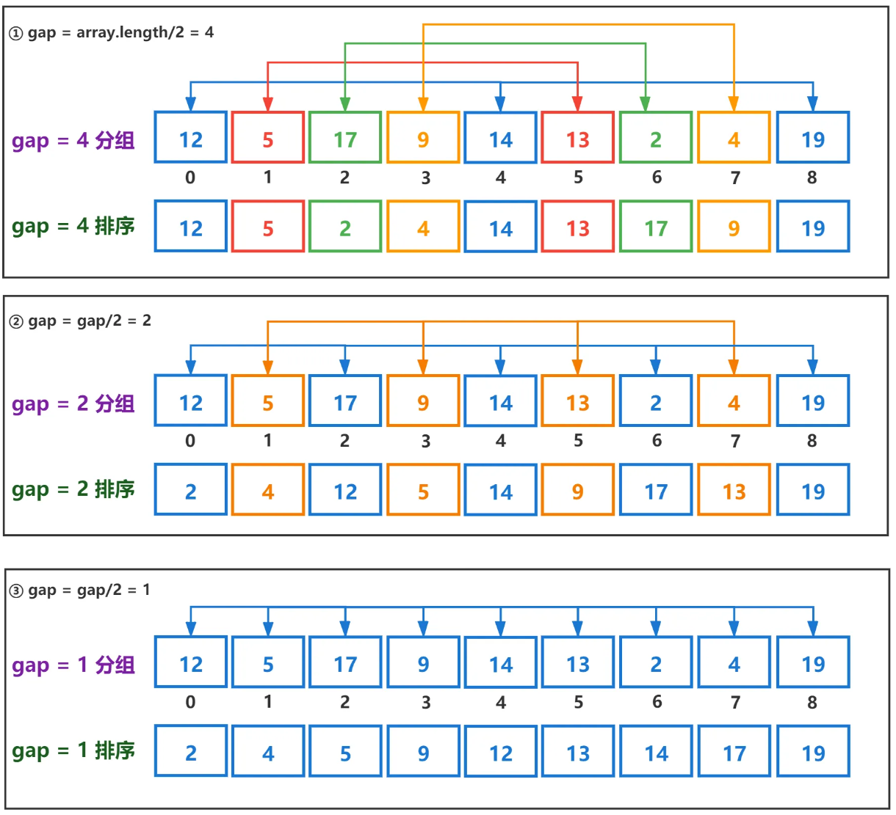
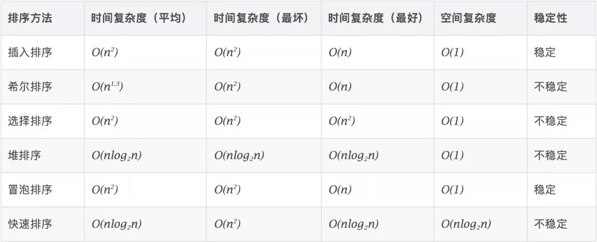

# ✨ 算法基础 ✨

## 时间&空间复杂度
- 复杂度是数量级（方便记忆、推广），不是具体数字。
- 常见复杂度大小比较：O(n^2) > O(nlogn) > O(n) > O(logn) > O(1)

### 时间复杂度
常见时间复杂度对应关系：
- O(n^2)：2层循环（嵌套循环）
- O(nlogn)：快速排序（循环 + 二分）
- O(n)：1层循环
- O(logn)：二分

### 空间复杂度
常见空间复杂度对应关系：
- O(n)：传入一个数组，处理过程生成一个新的数组大小与传入数组一致

## 八大数据结构
### 栈
栈是一个后进先出的数据结构。JavaScript中没有栈，但是可以用Array实现栈的所有功能。
```js
// 数组实现栈数据结构
const cxc = []
 
// 入栈
cxc.push(0)
cxc.push(1)
cxc.push(2)
 
// 出栈
const popVal = cxc.pop() // popVal 为 2

```
使用场景:
- 十进制转二进制
- 有效括号
- 函数调用堆栈

### 队列
队列是一个先进先出的数据结构。JavaScript中没有队列，但是可以用Array实现队列的所有功能。
```js
// 数组实现队列数据结构
const cxc = []
 
// 入队
cxc.push(0)
cxc.push(1)
cxc.push(2)
 
// 出队
const shiftVal = cxc.shift() // shiftVal 为 0

```
使用场景
- 日常测核酸排队
- JS异步中的任务队列
- 计算最近请求次数

###  链表
链表是多个元素组成的列表，元素存储不连续，用next指针连在一起。JavaScript中没有链表，但是可以用Object模拟链表。

使用场景:
- JS中的原型链
- 使用链表指针获取 JSON 的节点值

### 集合
集合是一个无序且唯一的数据结构。ES6中有集合：Set，集合常用操作：去重、判断某元素是否在集合中、求交集。
```js
// 去重
const arr = [1, 1, 2, 2]
const arr2 = [...new Set(arr)]
 
// 判断元素是否在集合中
const set = new Set(arr)
const has = set.has(3) // false
 
// 求交集
const set2 = new Set([2, 3])
const set3 = new Set([...set].filter(item => set2.has(item)))

```
使用场景: 求交集、差集

### 字典(哈希)
字典也是一种存储唯一值的数据结构，但它以键值对的形式存储。ES6中的字典名为Map，
```js
const map = new Map()
 
// 增
map.set('key1', 'value1')
map.set('key2', 'value2')
map.set('key3', 'value3')
 
// 删
map.delete('key3')
// map.clear()
 
// 改
map.set('key2', 'value222')
 
// 查
map.get('key2')
```
使用场景: leetcode刷题

### 树
树是一种分层的数据模型。前端常见的树包括：DOM、树、级联选择、树形控件……。JavaScript中没有树，但是可以通过Object和Array构建树。树的常用操作：深度/广度优先遍历、先中后序遍历。

使用场景:
- DOM树
- 级联选择器

### 图
图是网络结构的抽象模型，是一组由边连接的节点。图可以表示任何二元关系，比如道路、航班。JS中没有图，但是可以用Object和Array构建图。图的表示法：邻接矩阵、邻接表、关联矩阵。

使用场景:
- 道路
- 航班

### 堆

堆是一种特殊的完全二叉树。所有的节点都大于等于（最大堆）或小于等于（最小堆）它的子节点。由于堆的特殊结构，我们可以用数组表示堆。

使用场景: leetcode刷题

## 排序方法

### 冒泡排序
比较两个记录键值的大小，如果这两个记录键值的大小出现逆序，则交换这两个记录

每遍历一个元素，都会把之前的所有相邻的元素都两两比较一遍，即便是已经排序好的元素
```js
// [1,3,4,2] -> [1,3,2,4] -> [1,2,3,4] -> [1,2,3,4]
let n = 0
function bubbleSort(arr) {
  for(let i = 1;i < arr.length;i++) {
    for(let j = i;j > 0;j--) {
      n++ // 1+2+3+...+arr.length-1
      if(arr[j] < arr[j-1]) {
        [arr[j],arr[j-1]] = [arr[j-1],arr[j]];
      }
    }
  }
  return arr;
}
```
### 插入排序
第i（i大于等于1）个记录进行插入操作时，R1、 R2，...，是排好序的有序数列，取出第i个元素，在序列中找到一个合适的位置并将她插入到该位置上即可。

相当于把当前遍历的元素取出，在序列中找到一个合适的位置将它插入。它的第二层循环不必遍历当前元素之前的所有元素，因为当前元素之前的序列是排序好的，碰到第一个小于当前元素的值，就可以停止继续向前查找了，然后把当前元素插入当前位置即可
```js
function insertSort(arr) {
  for(let i = 1;i < arr.length;i++) {
    let j = i-1;
    if(arr[i]<arr[j]) {
      let temp = arr[i];
      while(j >= 0 && temp < arr[j]) {
          arr[j+1] = arr[j];
          j--;
      }
      arr[j+1] = temp;
    }
  }
  return arr;
}
// [1,3,4,2] -> [1,3,4,4] -> [1,3,3,4] -> [1,2,3,4]
// i=3 temp=2 j=2 arr[j]=4 arr[3]=4 [1,3,4,4]； j=1 arr[2]=3 [1,3,3,4]； j=0  [1,2,3,4]
```

### 希尔排序
算法先将要排序的一组数按某个增量d（n/2,n为要排序数的个数）分成若干组，每组中记录的下标相差d.对每组中全部元素进行直接插入排序，然后再用一个较小的增量（d/2）对它进行分组，在每组中再进行直接插入排序。当增量减到1时，进行直接插入排序后，排序完成。
```js
function hillSort(arr) {
  let len = arr.length;
  for(let gap = parseInt(len / 2);gap >= 1;gap = parseInt(gap / 2)) {
    for(let i = gap;i < len;i++) {
      if(arr[i] < arr[i-gap]) {
        let temp = arr[i];
        let j = i - gap;
        while(j >= 0 && arr[j] > temp) {
          arr[j+gap] = arr[j];
          j -= gap;
        }
        arr[j+gap] = temp;
      }
    }
  }
  return arr;
}
```


### 选择排序
在第i次选择操作中，通过n-i次键值间比较，从n-i+1个记录中选出键值最小的记录，并和第i（1小于等于1小于等于n-1）个记录交换

每一次遍历，都把当前元素与剩下元素里的最小值交换位置
```js
// [4,1,3,2] -> [1,4,3,2] -> [1,2,4,3] -> [1,2,3,4]
function selectSort(arr) {
  for(let i = 0;i < arr.length;i++) {
    let min = Math.min(...arr.slice(i));
    let index
    for (let j = i; j < arr.length; j++) {
      if (arr[j] === min) {
        index = j
        break
      }
    }
    [arr[i],arr[index]] = [arr[index],arr[i]];
  }
  return arr;
}
```

### 快速排序
在n个记录中取某一个记录的键值为标准，通常取第一个记录键值为基准，通过一趟排序将待排的记录分为小于或等于这个键值的两个独立的部分，这是一部分的记录键值均比另一部分记录的键值小，然后，对这两部分记录继续分别进行快速排序，以达到整个序列有序

取当前排序数组的第一个值作为基准值keys，通过一次遍历把数组分为right大于基准值和left小于等于基准值的两部分，然后对两个部分重复以上步骤排序，最后return的时候按照`[left,keys,right]`的顺序返回
```js
function quickSort(arr) {
  if(arr.length <= 1) return arr;
  let right = [],left = [],keys = arr.shift();
  for (let value of arr) {
    if (value > keys) {
      right.push(value)
    } else {
      left.push(value);
    }
  }
  return quickSort(left).concat(keys,quickSort(right));
}
// [4,1,3,2]-->quickSort([1,3,2]).concat(4,quickSort([]))
//         -->quickSort([]).concant(1,quickSort([3,2])).concat(4,quickSort([]))
//         -->quickSort([]).concant(1,quickSort([2]).concant(3)).concat(4,quickSort([]))
//         -->[1,2,3,4]
// keys=4 R[] L[1,3,2]  
-------quickSort(left)
// keys=1 R[3,2] L[]
// keys=3 R[] L[2]
// quickSort(left)=[1,2,3]
```
### 各排序算法的稳定性，时间复杂度，空间复杂度

每个语言的排序内部实现都是不同的。

对于 JS 来说，数组长度大于 10 会采用快排，否则使用插入排序。选择插入排序是因为虽然时间复杂度很差，但是在数据 量很小的情况下和 O(N * logN) 相差无几，然而插入排序需要的常数时间很小，所以相对别的排序来说更快。

##  JS尾递归优化斐波拉契数列
```js
const Fibonacci = (n) => {
  if (n <= 1) return 1;
  return  Fibonacci(n - 1) + Fibonacci(n - 2);
}
Fibonacci(10) // 89
Fibonacci(40) // 165580141 计算缓慢有延迟了
Fibonacci(100) // 栈溢出，无法得到结果
```
使用尾递归优化该方法
```js
const Fibonacci = (n, sum1 = 1, sum2 = 1) => {
  if (n <= 1) return sum2;
  return Fibonacci(n - 1, sum2, sum1 + sum2)
}
Fibonacci(10) // 89
Fibonacci(100) // 573147844013817200000 速度依旧很快
Fibonacci(1000) // 7.0330367711422765e+208 还是没有压力
```
尾递归优化可以在数量较大的计算中，可以起到很好的作用