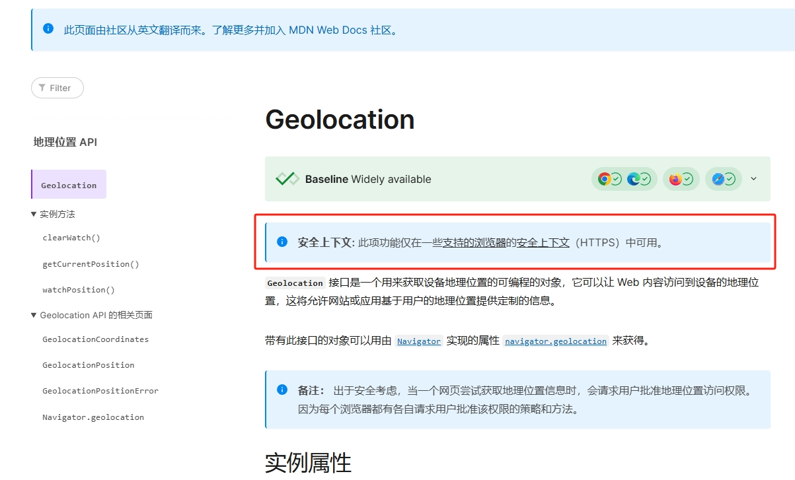
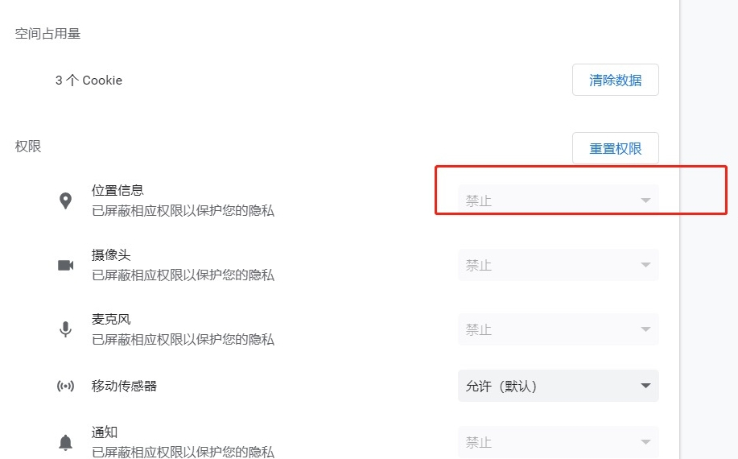

# 📍 H5 获取 当前位置定位

## 在本地测试的时候遇到一点问题

因为 `Geolocation API` 需要在 https 协议下才能使用，本地开发的默认协议是 http。



首先是先配置 `vue.config.js` 文件，添加 `server` 代理配置项，打开 `https` 协议。

```js
    server: {
      // 是否开启 https
      https: true,
    },
```

然后还需要再安装一个插件 `@vitejs/plugin-basic-ssl`

```bash
npm install @vitejs/plugin-basic-ssl
```

安装完成直接引入 `vite.config.js` 文件，添加 `plugins` 配置项。

```js
import basicSsl from "@vitejs/plugin-basic-ssl";
export default defineConfig(async ({ command, mode }) => {
  return {
    plugins: [vue(), basicSsl()],
  };
});
```

配置完成后发现，居然还是不行，相关位置的权限居然都是置灰，开启都开启不了。



搜索了资料，找到了一个方法 由于我的是 `Chrome` 浏览器，在 `Chrome` 浏览器中，通过地址栏输入 `chrome://flags/#unsafely-treat-insecure-origin-as-secure` 输入当前开发网址后，选择 enabled，重启浏览器。然后可以正常打开使用啦~ 完美！

然后封装的一个 js 文件，获取当前位置的函数。

```js
export const getLocation = (options = {}) => {
  const defaultOptions = {
    enableHighAccuracy: true,
    timeout: 12000,
    maximumAge: 0,
  };

  return new Promise((resolve, reject) => {
    if (!navigator.geolocation) {
      reject(new Error("GEOLOCATION_UNSUPPORTED"));
      return;
    }

    navigator.geolocation.getCurrentPosition(
      (position) =>
        resolve({
          lat: position.coords.latitude,
          lng: position.coords.longitude,
          accuracy: position.coords.accuracy, // 精度（米）
        }),
      (error) => reject(error),
      { ...defaultOptions, ...options }
    );
  });
};
```

[参考资料](https://developer.mozilla.org/zh-CN/docs/Web/API/Geolocation)
