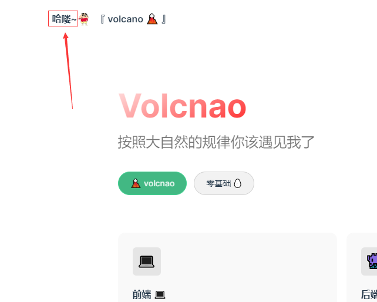
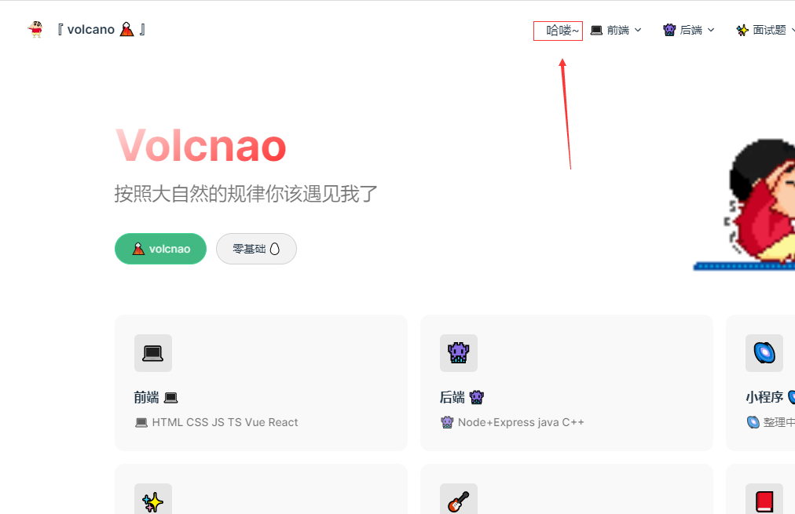
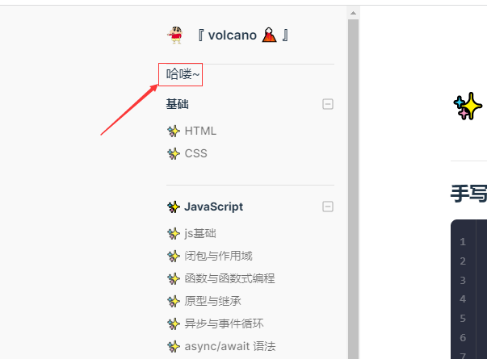
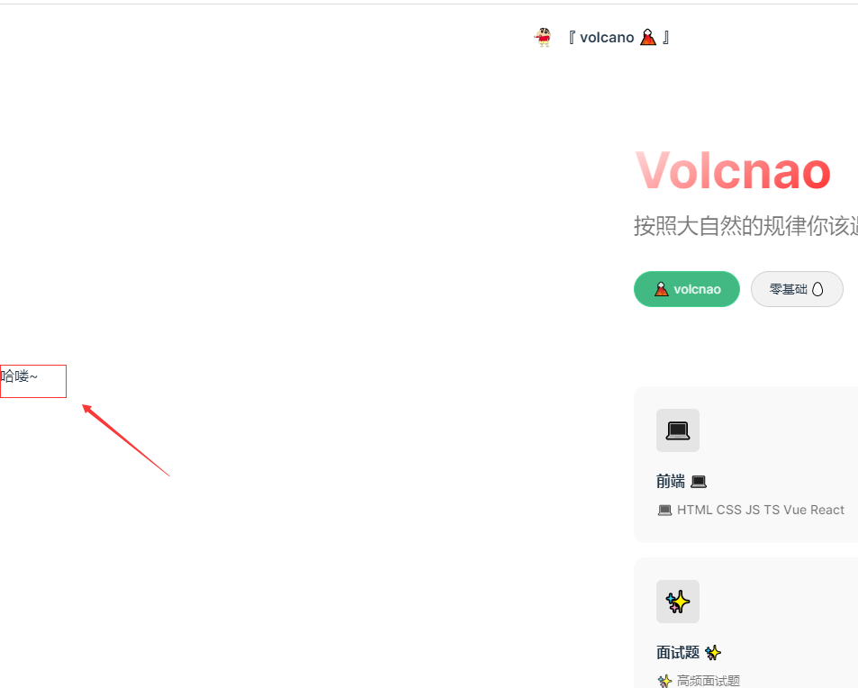
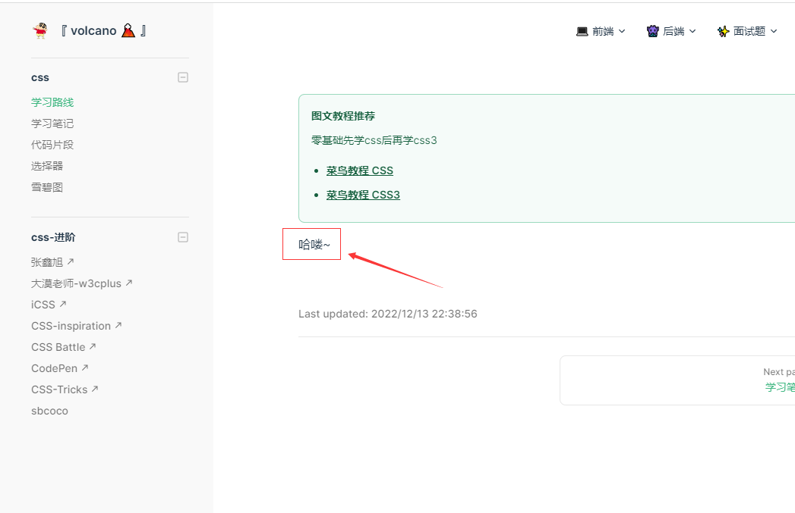
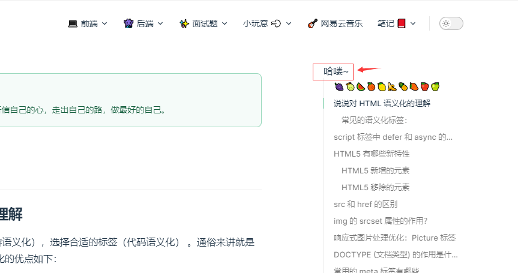
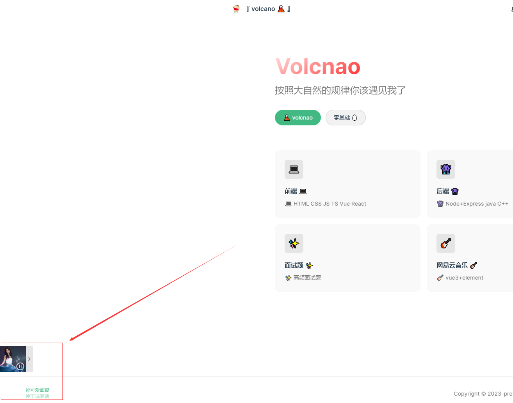

# 📦 VitePress部署 遇到的问题 和 解决方案📦

## dev本地没问题 打包的时候出现了  window is not defined
原因：

- 在写一个音乐组件的时候 引入了第三方库APlayer 因为第三方库使用了window对象

解决方案：

- 本地没问题是因为本地server模式  打包是ssr模式  ssr渲染里没有window对象
- 只需在使用该库的组件里的onMounted判断当前的是否在浏览器里 true的时候再引入赋值

```vue
<script  lang="ts" setup>
    import { inBrowser } from 'vitepress'
    //页面加载时
    onMounted(async () => {
        let APlayer = null
        if(inBrowser){
            let aplayerTemp = await import('aplayer')
            APlayer = aplayerTemp.default
        }
    })
</script>
```
- 
这样可以打包出来 功能效果也ok  但是打包的时候还是会出现一堆的`window is not defined`
还需要再用vitepress自带的全局组件`ClientOnly`包裹在里面 这样就完美打包啦~
```vue
<script  lang="ts" setup>
    import DefaultTheme from "vitepress/theme";
    const { Layout } = DefaultTheme;
</script>

<template>
  <Layout>
    <template #layout-bottom>
      <ClientOnly>
        <Music/>
      </ClientOnly>
    </template>
  </Layout>
</template>
```

## vitepress的一些插槽

### 总结
`nav-bar-title-before ` - `nav-bar-title-after `<br>
`nav-bar-content-before` - `nav-bar-content-after`<br>
`sidebar-nav-before` - `sidebar-nav-after`<br>
`home-hero-before` - `home-hero-after`<br>
`home-features-before` - `home-features-after`<br>
`doc-footer-before`<br>
`doc-before` - `doc-after`<br>
`aside-top` - `aside-bottom`<br>
`aside-outline-before` - `aside-outline-after`<br>
`aside-ads-before` - `aside-ads-after`<br>
`layout-bottom`
- 我去 还挺多的😲 顾名思义after就是在的后面啦~ 后面只展示before

使用：
```vue
<script  lang="ts" setup>
import DefaultTheme from "vitepress/theme";
const { Layout } = DefaultTheme;
</script>
<template>
  <Layout>
    <template #nav-bar-title-before> 哈喽~ </template>
  </Layout>
</template>
```
### nav-bar-title-before


### nav-bar-content-before


### sidebar-nav-before


### home-hero-before


### home-features-before


### doc-footer-before

- `doc-footer-before`和`doc-after`类似 
- `doc-before`就是在文章的顶部
### aside-top

- aside的插槽都是在右边的锚点导航栏

### layout-bottom

在每个页面左下角 我用来放音乐组件 
