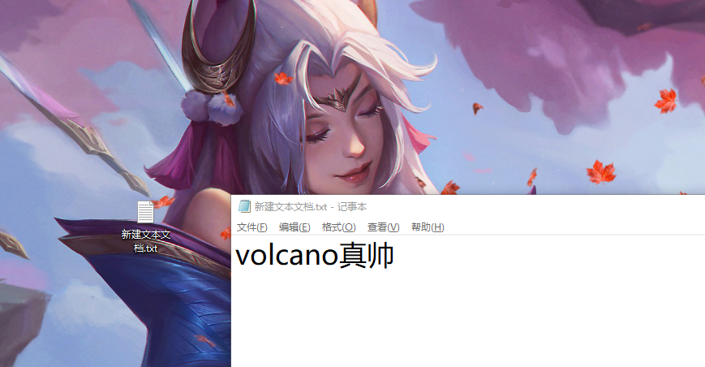
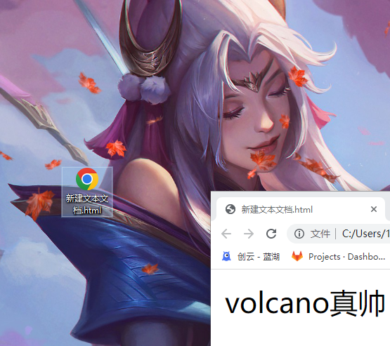

# 👋 Hello World

以下这个例子会非常简单，你可以尝试一下。增强你的学习信心。

## 一、右键电脑桌面，新建一个txt

## 二、然后打上“volcano真帅” 并且按保存
或者使用快捷键 `Ctel+S` 保存

> 通常这一步，文本应该打上“Hello World"....

  

## 三、关闭文件后把后缀名改成html
  
这时候 文件会变成你电脑默认浏览器的图标。

::: danger 注意  
如果你的文件没有txt后缀名，有可能是你的电脑没有开启【文件扩展名】 

<h3>开启【文件名】后缀</h3>  

打开【我的电脑】或【此电脑】，找到【查看】【显示】【文件扩展名】
   
::: 

## 四、双击打开刚刚写好的html文件
  

### 🥳恭喜恭喜🎉
你已经成功的写出你的第一个网页。  

你可能会说：“就这？”  

其实我们还没有使用上【HTML】，只不过创建了一个HTML文件，但这是为了方便让你理解。“哦！它这个网页文件是可以编辑的”

编辑的时候修改后缀名为txt  
展示的时候修改为：html  
这显然很麻烦...  
所以我们需要【代码编辑器】，这样既可以打开来编辑，也可以打开成【网页】来给我们看。

后面我们会先去准备好我们的趁手兵器！然后继续学习！