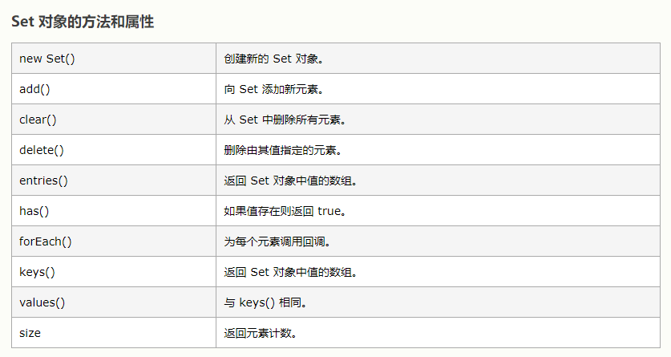

#  JS Map 和 Set

##  map
```javascript
var m = new Map([['cxc', 95], ['cxcg', 75], ['cxcgg', 85]]);
m.get('cxc');           // 95

var m = new Map();          // 空Map
m.set('cxc', 67);          // 添加新的key-value
m.has('cxc');              // 是否存在key 'cxc': true
m.get('cxc');              // 67
m.delete('cxc');           // 删除key 'cxc'
m.get('cxc');              // undefined
```
##  set
是一个不会重复的列表List。

```javascript
const s = new Set();
const s = new Set([1, 1, 2, 3, 4, 4, 5, 6, 7, 4, 2, 1]);

Array.from(s); //  [1, 2, 3, 4, 5, 6, 7]
```
###  利用set去重数组
```javascript
const arr = [1, 2, 3, 3, 4, 5, 4, 4, 2, 1, 3];
Array.from(new Set(arr)); // [1, 2, 3, 4, 5]
```
###  set 转成 数组
```javascript
const s = new Set([1, 2, 3]);
Array.from(s); // [1, 2, 3]
```
  

###  迭代

- keys():返回键名;
- values(): 返回键值；
- entries(): 返回键值对;
```javascript
const s = new Set();
s.add(1).add(2).add(3);
Array.from(s.keys()); // [1, 2, 3]
Array.from(s.values()); // [1, 2, 3]
Array.from(s.entries()); // [[1, 1], [2, 2], [3, 3]]
```
```javascript
//for-of
const s = new Set([1,2,3]);
for (const i of s) {
	console.log(i);
}
// 1
// 2
// 3
```
```javascript
//forEach
const s = new Set([1,2,3]);
s.forEach((value, key) => console.log(key + ' : ' + value));
// 1 : 1
// 2 : 2
// 3 : 3
```
