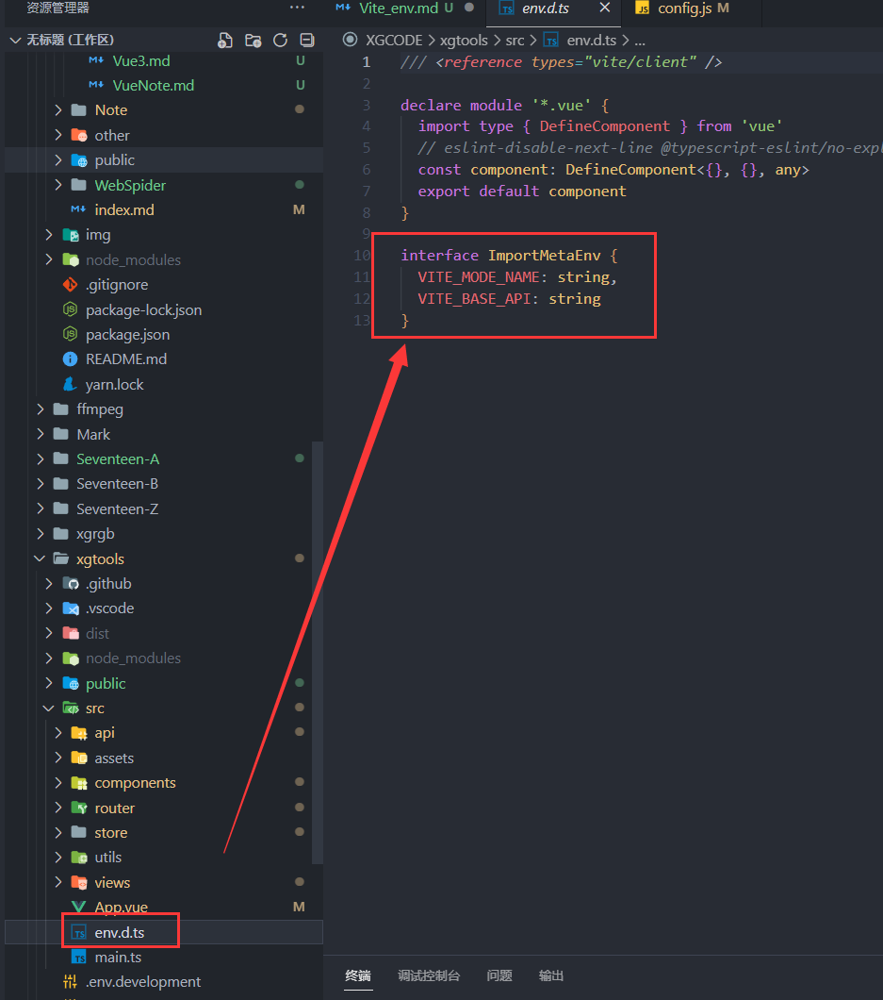
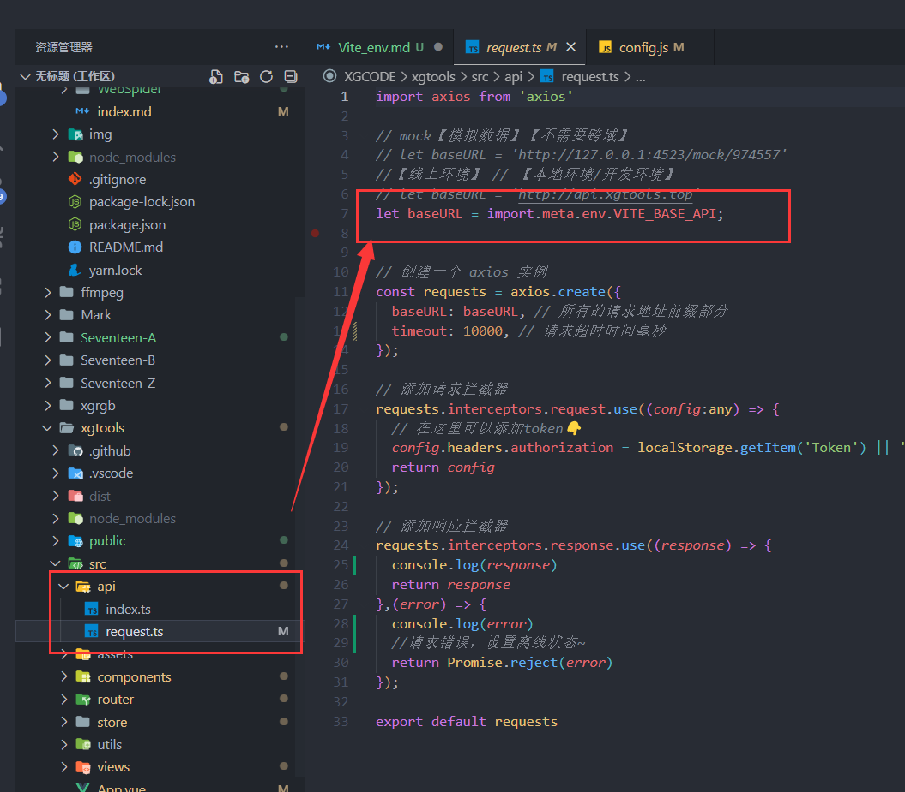

# Vite 区分环境

区分开发环境有个好处就是在【开发环境】写的一些东西不会带到【生产环境】中去，比如在【开发环境】可以设置好【测试api的地址】，这样就不用在上线时改成【真实的api地址了】。要不然忘记改了就麻烦了~
### 在项目根目录新建 
1. .env.development
2. .env.production
3. .env.test
```javascript
//开发环境.env.development
VITE_MODE_NAME = development
VITE_BASE_API = http://127.0.0.1:3000/
```
```javascript
//生产环境 .env.production
VITE_MODE_NAME = production
VITE_BASE_API = http://api.xgtools.top/
```
```javascript
//测试环境.env.test
VITE_MODE_NAME = test
VITE_BASE_API = http://127.0.0.1:4523/mock/974557
```
### 创建代码提示 env.d.ts

  

```typescript
interface ImportMetaEnv {
  VITE_MODE_NAME: string,
  VITE_BASE_API: string
}
```
### 使用
  

```typescript
let baseURL = import.meta.env.VITE_BASE_API;
```
#### 在vite.config.ts中使用👇
```typescript
env.VITE_RES_URL
```
### package.json
```json
"scripts": {
  "dev": "vite --open",
  "build": "vue-tsc --noEmit && vite build",
  "test":"vite --mode test",
  "preview": "vite preview"
}
```
