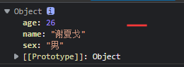
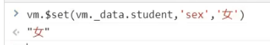
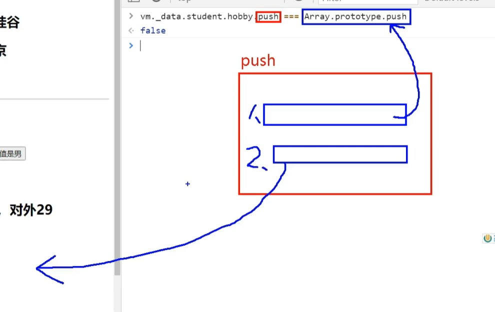

# Vue2 底层原理 Object.defineProperty

::: tip 推荐学习
b站视频：[ 尚硅谷 | P11 P12 P13 ](https://www.bilibili.com/video/BV1Zy4y1K7SH?p=11&vd_source=3f0088ad79c805c26d24a196ef28e918)  
b站视频：[ 尚硅谷 | P34 P35 P36 ](https://www.bilibili.com/video/BV1Zy4y1K7SH?p=34&vd_source=3f0088ad79c805c26d24a196ef28e918)
:::
其实在刚开始学习 Vue，以及做项目的时候可以暂时不了解底层原理。  
但是毕竟是学习嘛，到后面还是需要把底层原理了解一下的

像 Vue 的数据绑定，双向绑定以及计算属性... 都和这个`Object.defineProperty`息息相关，这个 `Object.defineProperty` 也是在 ES6 后出来的新东西！借着这个机会，我做做笔记。

用一个简单的 index.html 文件来记录一下 `Object.defineProperty` 的基本作用

### 第一种：直接定义数据

```html
<script type="text/javascript">
  let person = {
    name: "volcano",
    sex: "男",
    age: 26,
  };

  console.log(person);
</script>
```

### 第二种： `Object.defineProperty` 

```html
<script type="text/javascript">
  let person = {
    name: "volcano",
    sex: "男",
    // age:26
  };

  Object.defineProperty(person, "age", {
    value: 18,
  });

  console.log(person);
</script>
```



他们之前的区别在于
1. 通过 `Object.defineProperty` 代理进去的数据，【不参与遍历、枚举】
2. 通过 `Object.defineProperty` 代理进去的数据，【不能被修改】
3. 通过 `Object.defineProperty` 代理进去的数据，【不能被删除..】

```js
//遍历不出来
for(let index in person){
  console.log(person[index])
}
// volcano
// 男
// 没有18

//遍历不出来
console.log(Object.keys(person));
// name
// sex
// 没有age
```
 没有年龄  

  


#### `enumerable` 枚举

如果需要 `Object.defineProperty` 代理进去的数可以被【遍历】【枚举】就使用 `enumerable`
```js
Object.defineProperty(person, "age", {
  value: 18,
  enumerable:true, // 控制属性是否可以被枚举，默认false
});
```

#### `writable` 修改
如果需要 `Object.defineProperty` 代理进去的数可以被【修改】就使用 `writable`
```js
Object.defineProperty(person, "age", {
  value: 18,
  enumerable:true, // 控制属性是否可以被枚举，默认false
  writable:true, //控制属性是否可以被修改，默认false
});
```

#### `configurable` 删除
如果需要 `Object.defineProperty` 代理进去的数可以被【修改】就使用 `configurable`

```js
Object.defineProperty(person, "age", {
  value: 18,
  enumerable:true, // 控制属性是否可以被枚举，默认false
  writable:true, //控制属性是否可以被修改，默认false
  configurable:true, //控制属性是否可以被删除，默认false
});
```

::: tip 
也就是说 `Object.defineProperty` 是可控的！
:::
## `Object.defineProperty` 的 `get` 和 `set`
1. 读取person的age属性的时候，get函数就会被调用，返回age值
2. 修改person的age属性的时候，set函数就会被调用
```js
let number  = 18
let person = {
  name: "volcano",
  sex: "男",
  // age:26
};

Object.defineProperty(person, "age", {
  get(){
    return number
  }
  set(value){
    number = value
  }
});
```

## Vue中的 `Object.defineProperty` - 数据代理

1. Vue中的数据代理：
   1. 通过vm对象来代理data对象中属性的操作（读/写）
   2. 【vm是整个Vue的实例】
2. Vue中数据代理的好处：
   1. 更加方便的操作data中的数据
3. 基本原理：
   1. 通过 `Object.defineProperty` 把data对象中所有属性添加到vm上，为每一个添加到vm上的属性，都指定一个 `getter/setter`。在`getter/setter` 内部去操作（读/写）data中对应的属性。


  

- ` vm._data = data = 数据劫持`
::: tip
也就是说 当你在 data 这个属性里设置数据的时候，Vue 拿着这些数据 去做【数据代理】。
1. 一来，当你在操作js的时候，还是一样只有js那部分是变动的。
2. 二来，通过 `Object.defineProperty` 里的set，Vue偷偷拿着你改掉的数据去改动要展示的HTML模板，以此来达到响应式的效果！

所以 Vue  就以此 达到MVVM的效果了！也就是我们常说的 你只需要处理 js数据，view展示的部分交给Vue，咱再也不用操作DOM元素了~
:::

## Vue检测数据改变的原理 - 数据劫持

::: tip 推荐学习
b站视频：[ 尚硅谷 | P34 P35 P36 ](https://www.bilibili.com/video/BV1Zy4y1K7SH?p=34&vd_source=3f0088ad79c805c26d24a196ef28e918)
:::

- 传入data的数据，都是以【数据代理】的方式保存在vue实例（vm）里的，在保存之前Vue还做了【数据劫持】以此来监听数据的变化

当你修改数据的时候，`Object.defineProperty` 里的 `set` 监听到后做了一系列操作，其中就包括把代理的数据更新到页面模板上去，以此来响应式的更新页面！


  

## Vue.set

1. 直接在vm上 加入数据是不会有响应式的
2. 因为vm上所有的数据都来自 `_data` 也就是 `data`
3. 所以Vue提供了一个 `Vue.set` 来让你可以 追加 - 响应式数据

  

  

`Vue.set` 和 `vm.$set`

## Vue监听数组的原理
  

可以看到在`data`中定义的数组里 数据代理 并没有 `setter` 和 `getter`
所以在Vue中无法直接修改数组里的值（可以用push、pop、shift...这些方法）

 以下修改会失败！（无法响应式）！！！
  
- 不能直接根据【索引】来修改值，无法响应式更新
- 但是使用push、pop这些改变数组的方法却可以完成响应式更新

那么问题来了！Vue 如何监听数组被 push、pop... 了？

####  Vue 如何监听数组被 push、pop... 了

1. 原理是Vue的底层把数组的push进行【包装】

  

这个包装
1. 一方面还是一样老老实实进行了数据的push
2. 另一方面去帮忙渲染模板里的数据了


也就是其实这个push是个包装，包装里第一步还是原来那个没有响应式的push，第二步再去更新模板数据。
  

#### 替换数组

以上 7种 变更数组 的方法 都是因为本身就会【修改原数组】   
但是还有其他一些【数组方法】他们是不会修改【原数组】的  

例如说`filter` `concat` `slice` 他们只会返回一个【新的数组】

这时候可以用【新数组】把这个【旧数组】替换掉！

### 数组总结

1. 不能在对 data 里面的 数组 进行 直接【赋值】的修改
2. 在Vue 要改变数组里面的值 要使用以上这七个方法！