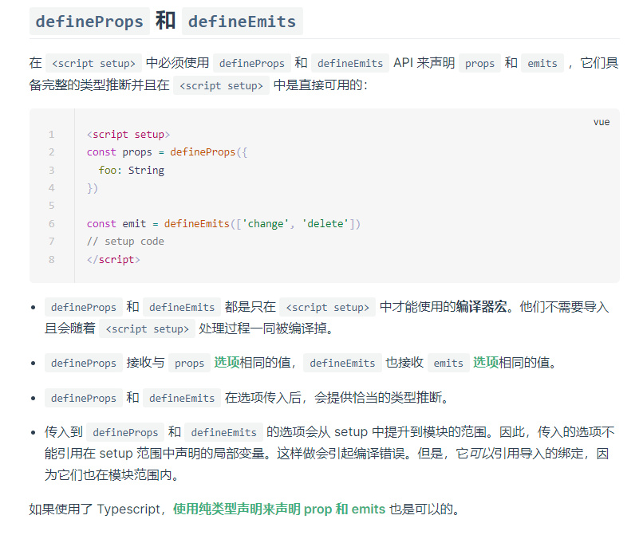

# Vue3 

::: tip 推荐学习教程
b站视频：[尚硅谷Vue2.0+Vue3.0全套教程丨vuejs从入门到精通](https://www.bilibili.com/video/BV1Zy4y1K7SH)
::: 
Vue3 其实和Vue2 有很多相似之处，所以会Vue2，要学习Vue3 不是很难。  有一些是写法上的区别而已。


1. Vue3需要 Vue-cli 4.5.0 以上才可以创建 / 或使用 Vite 
## 定义组件 defineComponent
```vue
<script>
  //vue3 需要从 vue中 拿到一个函数 defineComponent【定义组件】
  import { defineComponent } from 'vue'
  export default defineComponent({
    name:'Home', //组件名称
    props:{ //接收父组件的数据
      
    },
    components:{ //定义子组件
      
    },
    setup(props,ctx){ //接收两个参数
      return{
        
      }
    }
  })
</script>
```
## ref - 定义单个数据 

1. 在vue3.x 的setup中，你定义的变量，如果想用到 上面的HTML模板里，要用【ref】定义。
1. 并且需要 return 将它返回出去
```vue
<template>
  <div class="home">
    {{lalala}}
  </div>
</template>

<script lang="ts">
import { defineComponent,ref } from 'vue';

export default defineComponent({
  name: 'Home',
  setup(){
    let lalala = ref("cxc");
    return{
      lalala,
    }
  }
});
</script>
```
### 访问ref定义的数据，要写【数据名.value】
```vue
<template>
    <button @click="clickNum">点击</button>
</template>

<script lang="ts">
import { defineComponent,ref,reactive,toRefs} from 'vue';

export default defineComponent({
  name: 'Test',
  setup(){
    let num = ref('101')
    let clickNum = () => {
        //访问ref定义的数据，要写【数据名.value】
        console.log(num.value) //101
    }
    return{
      num
    }
  }
});
</script>

```
## reactive - 定义对象数据：
```vue
<template>
  <div class="home">
    {{lalala}}
    {{data.name}}
    {{data.age}}
  </div>
</template>

<script lang="ts">
import { defineComponent,ref,reactive } from 'vue';

export default defineComponent({
  name: 'Home',
  setup(){
    let lalala = ref("cxc");
    let data = reactive({
      name:'cxc',
      age:18,
      obj:{
        price:0
      }
    })
    return{
      lalala,
      data,
    }
  }
});
</script>
```
## toRefs - 解构数据
```vue
<template>
  <div class="home">
    {{lalala}}
    {{data.name}}
    {{data.age}}
    {{name}}
    {{obj}}
  </div>
</template>

<script lang="ts">
import { defineComponent,ref,reactive,toRefs} from 'vue';

export default defineComponent({
  name: 'Home',
  setup(){
    let lalala = ref("cxc");
    let data = reactive({
      name:'cxc',
      age:18,
      obj:{
        price:0
      }
    })
    return{
      lalala,
      data,
      ...toRefs(data)
    }
  }
});
</script>

```
可以直接写 name 不用写 data.name 但是会冲突, 所以要注意！只是方便而已~

## Vue3.x 使用Vuex

1. useStore 可以拿到整个vuex
1. 在setup中将useStore赋值变量
1. 在计算属性中，用return返回其中的数据
```vue
<script lang="ts">
import { defineComponent, ref , computed } from 'vue';
import { useStore } from 'vuex';
  
export default defineComponent({
  setup() {
    let store = useStore()
    
    let list = computed(()=>{
      return store.state.list
    })
    
    return {
      add_todo_value,
      list,
    }
  }
});
</script>
```
## Vue3.x 使用Router
### 编程式导航

1. 使用【useRouter】赋值给【router】
1. 使用【router.push】
```vue
<template>
    <button @click="goto">跳转</button>
</template>

<script lang="ts">
import { defineComponent, ref,computed } from 'vue';
import { useRouter } from 'vue-router';
export default defineComponent({
  setup() {
    let router = useRouter()
    let goto = () =>{
        router.push("./about")
    }
    return {
      goto
    }
  }
});
</script>
```
### 传参
```javascript
let goto2 = () =>{
  router.push({
    path:'/Test2',
    query:{
      name:name.value,
      num:num.value
    }
  })
}
```
```javascript
let goto2 = () =>{
  router.push({
    name:'Test2',
    params:{
      name:'cxc'
    }
  })
}
```
### 获取参数：

- 使用【useRoute】 赋值给变量【route】
- route.query【会在url上、使用path】
- route.params【使用name】
```vue
<script lang="ts">
import { defineComponent,ref} from 'vue';
import { useRouter,useRoute} from 'vue-router';
export default defineComponent({
  setup() {
    let router = useRouter()
    //route 是当前路由对象
    let route = useRoute()
    console.log(route.query)


    let goto = () =>{
        router.push("./test")
    }
    return {
      goto,
    }
  }
});
</script>
```
## Vue3.x 使用【计算属性】

1. 引入computed模块
1. 在setup中使用
```vue
<script lang="ts">
import { computed, defineComponent, ref } from 'vue';
export default defineComponent({
    name: "IconSvg",
    props: {
        iconClass: {
            type: String,
            required: true
        }
    },

    setup(props,ctx) {
        let iconName = computed(() => {
            return `#${props.iconClass}`
        })
        return {
            iconName,
        }
    }

});
</script>
```
## 生命周期
### 1、setup【不需要声明、引入】
```javascript
setup(){
  //组件创建的过程
}
```
### 2、onMounted
```javascript
import { onMounted } from 'vue'

export default defineComponent({
  setup(){
    onMounted(){
      //组件挂载的过程
      //数据dom
      //发请求
      //数据初始化操作，接收路由参数
    }
  }
})
```
### 3、onUnmounted
```javascript
import { onUnmounted } from 'vue'

export default defineComponent({
  setup(){
    onUnmounted(){
      //组件卸载时的生命周期
      //清除定时器，清除闭包函数。
    }
  }
})
```
### 4、...... 
## 关于【父子传参】

1. 这里父子传参和vue2.x的差不多
### 【父传子】子组件接受参数（父传参：略）
```js
//【子组件】
props:{
  msg:{
    tpye:String
  }
}
setup(props){
  console.log(props)
}
```

```js
let Props = defineProps({
    list: Object,
    list_name: String
})

const emit = defineEmits(['finish', 'deltodo'])

// console.log('没有传过来')
let finish = (data: any) => {
    emit('finish',data )
}
let deltodo = (data: any) => {
    emit('deltodo', data)
}
```
  

### 【子传父】
```javascript
//【子组件】
setup(props,ctx){
  let send = () => {
    ctx.emit('getName','cxc');
    //通过ctx.emit分发事件
    //第一个参数是事件名称，第二个是传递的数据
  }
}
```
【父组件】接受方法
```html
<div @getName='fn()'></div>
```
## 引入json
```js
import ACL from '../assets/json/AliCloud_List.json'
```
## vue 监听浏览器窗口
```javascript
window.onresize = () => { //当窗口发生改变时触发 
 		windowWidth.value = window.document.body.clientWidth;
 		console.log(1)
};
```

