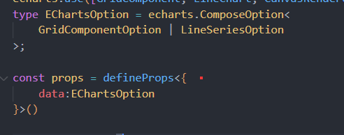

# 父子组件
## 【父传子】defineProps
### 父 传给 子 跟Vue2 没太大区别
```vue
<template>
	<Zi :data="cxc"/>
</template>

<script setup lang='ts'>
import Zi from '../components/zi.vue'
let cxc = 'lalala'
</script>
```

### 子 这边需要用defineProps 来接【这也是关键】
```vue
<template>
    {{data}}
</template>

<script setup lang="ts">
const props =defineProps({
    data:String
    required:true,  //必要性
    default: 'cxc' //默认值，选填写
})

console.log(props.data)
</script>
```
  

## 【子传父】defineEmits

### 子组件 发送方法
```vue
<template>
  <button @click="go_fu_emit()"></button>
</template>

<script setup lang="ts">

const emit = defineEmits(['fn'])

const go_fu_emit = ()=>{
    emit('fn',true)
}
</script>
```
### 父组件 接收方法跟Vue2 没区别
```vue
<template>
    <zi  @emit='cxc()'/>
</template>

<script setup lang='ts'>
import Zi from '../components/zi.vue'

const cxc = () =>{
    console.log('msg')
}
</script>
```

