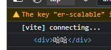

# 绑定元素 ref

```vue
<template>
    <div ref="box">哈哈</div>
</template>
 
<script setup lang='ts'>
import { ref,onMounted } from "vue";

const box = ref(null)

onMounted(()=>{
    console.log(box.value)
})
</script>
```

 