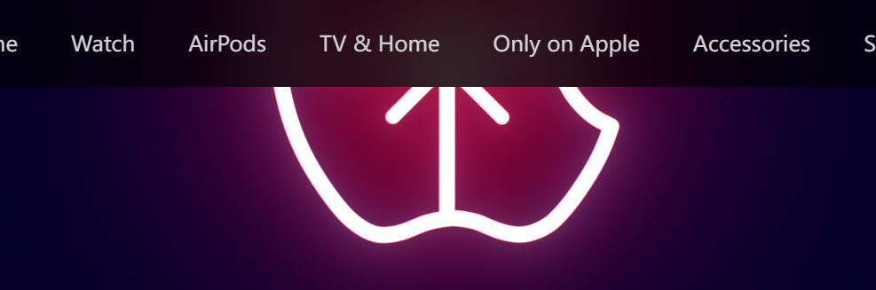
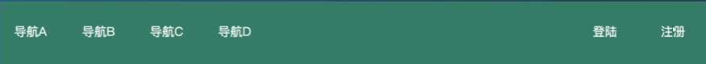
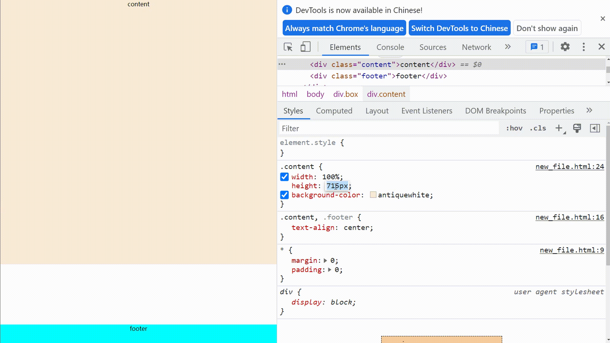

# css代码片段

## 清除浮动代码

```css
.clearfix:after {
    display:block;
    content:'';
    clear:both;
    height:0;
}
.clearfix {
    zoom: 1;
}
```

## 隐藏滚动条

```css
.note-menu::-webkit-scrollbar {     
    display: none;
}
```

## 防止单行文字溢出

```css
.text{
    text-overflow:ellipsis;
    overflow:hidden;  
    white-space:nowrap;
}
```

## 背景图片居中

```css
.img{
	background:url(xxx);
	background-position-x: center;
	background-position-y: center;
}
```

## 去掉 input 发光

```css
input:focus{
    box-shadow:none;
}
或者
input:focus{
    outline: none;
}
```
## 多行文字… 省略的方法

```css
.text{
	overflow: hidden;
	word-break: break-all;  /*允许在单词内换行，更美观*/
	text-overflow: ellipsis;
	display: -webkit-box;  /*元素作为box伸缩盒子*/
	-webkit-line-clamp: 3;  /*设置文本行数限制*/
	-webkit-box-orient: vertical;  /*设置文本排列方式*/
}
```

## 在position:fixed 下居中

```css
.class{
    position:fixed;
    left: 0;
    right: 0;
}
```

## ... 代替“溢出字”

```css
.class{
    overflow: hidden;
    text-overflow: ellipsis;
    white-space: nowrap;
}
```

## 单词/数字 不换行溢出解决办法

```css
.text{
    word-break: break-all;
    word-wrap: break-word;
}
```

## 高斯模糊背景效果_backdrop-filter滤镜
  
```css
.nav{
    background-color: rgba(0,0,0,0.8);
    backdrop-filter:  blur(20px);
}
```

## backdrop-filter和filter
- `blur` 可以设置图片使用高斯模糊效果，单位值是px。所谓高斯模糊
- `invert`可以设定反色， 值为0-1之间的小数
- `saturate`可以设定照片饱和度，取值范围为数字即可，默认值1，即100%。
- `grayscale`   代表灰度，取值在0-1之间
- `sepia`       代表的是照片褐色，类似于大部分美图软件里的怀旧功能的那种效果，取值也是0-1
- `hue-rotate`  用来改变图片的色相，默认值为0deg，取值是角度（angle）
- `brightness`  可以改变图片的亮度，默认值为100%,即1
- `contrast`    代表对比度，这个属性取值和饱和度saturate类似，取值也是数字
- `drop-shadow` 这个属性类似于box-shadow，给图片加阴影

::: tip 区别
Filter不仅仅作用于当前元素，后代元素也会继承这个属性，作用于一个空背景元素则没有效果。
backdrop-filter 是使透过该层的底部元素模糊化
backdrop-filter属性可以让你为一个元素后面区域添加图形效果（如模糊或颜色偏移）。 因为它适用于元素 背后 的所有元素，为了看到效果，必须使元素或其背景至少部分透明。
backdrop-filter目前兼容性不佳，尤其是安卓移动端。
:::

## 快速实现水平垂直居中的两个不常见的方法
### 第一种
```html
<div class="box">
	<div class="nav">
		
	</div>
</div>
```
```css
.box{
    display: grid;
    place-content: center;
}
```
#### 缺点 IE有些版本不兼容 但是主流浏览器兼容程度达到了95%

### 第二种
```html
<div class="box">
	<div class="nav">
		
	</div>
</div>
```
```css
.box{
    display: grid;
}
.nav{
    margin: auto;
}
```
在flex格式化上下文中，设置了margin: auto 的元素，在通过justify-content 和align-self 进行对齐之前,任何正处于空闲的空间都会分配到该方向的自动margin中去

## 导航栏左右布局小技巧
如果大家要写这样的布局的话 一般大家是怎么写的？
  
现在可以使用这个方法快速实现
```html
<ul class="nav">
    <li>导航A</li>
    <li>导航B</li>
    <li>导航C</li>
    <li class="login">登录</li>
    <li>注册</li>
</ul>
```
```css
.nav{
    display: flex;
}
.login{
    margin-left: auto;
}
```
设置了margin-left: auto的元素会把水平方向空余的空间占满 所以后面的元素就会定位到最右边

### 同理可以制作动态的footer栏
假如footer栏需要在不满屏的时候固定在底部  满屏的时候可以把footer栏顶下去
  
代码如下  把footer设一个 margin-top: auto样式 会把垂直空余的空间占满
```html
<div class="box">
	<div class="content">content</div>
	<div class="footer">footer</div>
</div>
```
```css
.box{
    min-height: 100vh;
    display: flex;
    flex-direction: column;
}
.content{
    width: 100%;
    height: 300px;
    background-color: antiquewhite;
}
.footer{
    height: 50px;
    margin-top: auto;
    background-color: aqua;
}
```

## 如何实现平行四边形布局效果
transform  叠加三角形
<br>
但是如果图形内部还有文字，需要正常排布呢
<br>
transform  叠加三角形就都不可行了
<br>
可以使用文字环绕之`shape-outside`
<br>
`shape-outside`定义了一个可以是非矩形的形状，相邻的内联内容应围绕该形状进行排版 要配合浮动来使用

### 怎么使用呢
`shape-outside:<basic-shape> | <shape-box> | <image> | none |  initial | inherit`
- `basic-shape` 它用于定义应用于计算浮点数区域的形状。可以使用支持的函数之一创建形状
- `circle()` 用于制作圆形。
- `ellipse()` 用于制作椭圆形。
- `inset()` 它用于制作矩形。
- `polygon()` 它用于制作具有3个以上顶点的形状。
- `path()` 它用于创建具有直线，圆弧或曲线的形状。